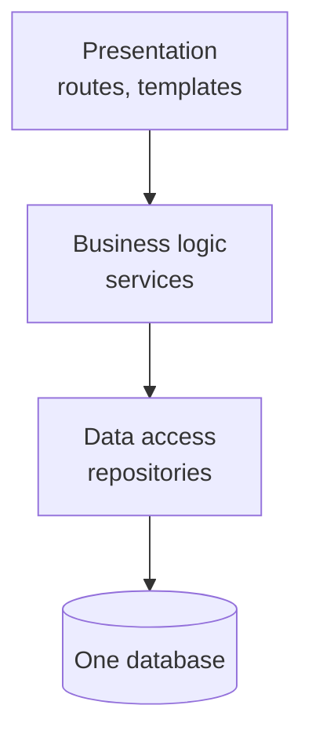
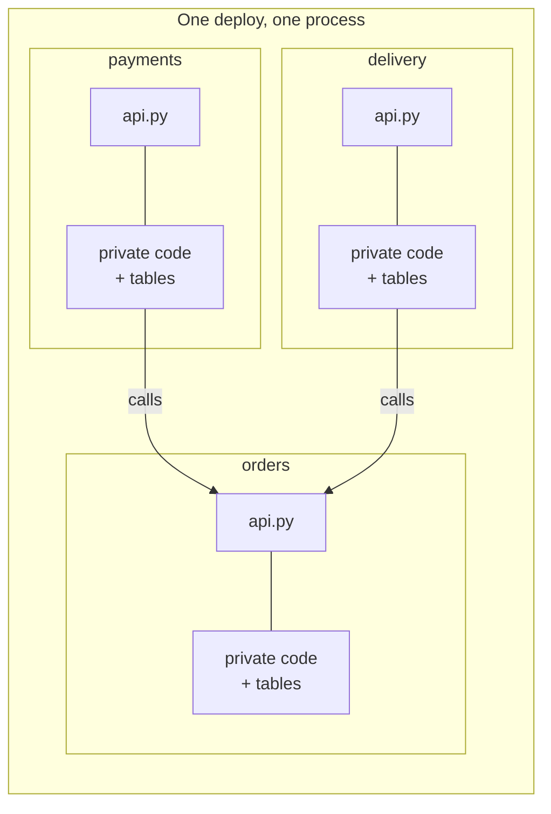
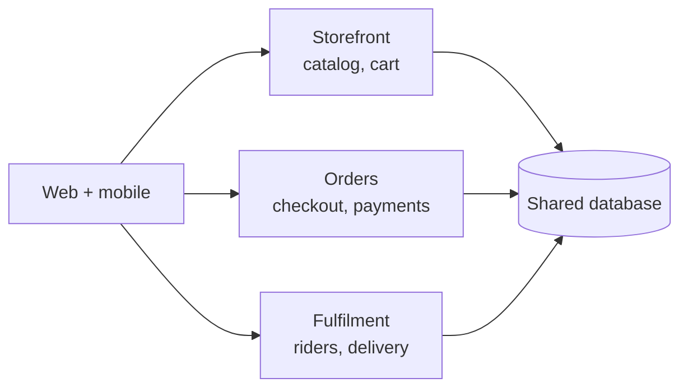
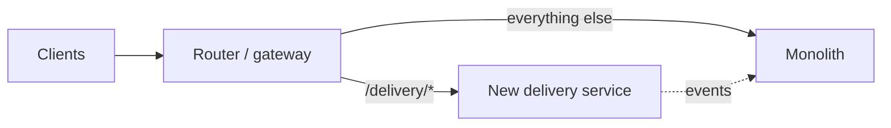

> **Table of Contents:**
>
> - [Everyone Wants Microservices](#everyone-wants-microservices)
> - [What an Architecture Style Actually Is](#what-an-architecture-style-actually-is)
> - [The Layered Monolith](#the-layered-monolith)
> - [The Modular Monolith](#the-modular-monolith)
> - [Microservices: What You're Really Buying](#microservices-what-youre-really-buying)
> - [The Quiet Middle: Service-Based](#the-quiet-middle-service-based)
> - [How to Choose](#how-to-choose)
> - [Splitting When It's Time](#splitting-when-its-time)
> - [Putting It Together](#putting-it-together)

---

## Everyone Wants Microservices

Picture a team of three building an online hardware shop in Nairobi. Customers browse, pay with M-Pesa, and a rider delivers. Someone reads a blog post from a company with four thousand engineers, and by the end of the month there are eleven services: `catalog`, `cart`, `orders`, `payments`, `riders`, `notifications`, and five more nobody can quite explain.

Six months later, adding a "delivery notes" field to an order takes four pull requests across four repositories, a coordinated deploy, and a prayer. Local development needs Docker Compose, nine containers, and a laptop fan that sounds like a matatu going uphill.

Nothing about the product needed eleven services. The team didn't have eleven teams' worth of problems. They had three people's worth, and they paid for eleven.

Most people treat architecture styles like levels in a game: monolith first, microservices once you're serious. That's not how it works. A style is a **shape**, and every shape is good at some things and bad at others. The skill is picking the shape that matches the problems you actually have, not the ones you'd like to have.

---

## What an Architecture Style Actually Is

Strip away the buzzwords and a style answers two questions:

1. **How many things do you deploy?** One unit, a handful, or dozens.
2. **How do the parts talk to each other?** Function calls inside one process, or messages over a network.

That's it. Everything else, the scaling story, the team structure, the failure modes, falls out of those two answers.

A function call is fast, never gets lost, and can't time out halfway. A network call is slow, can vanish, and can succeed on the other side while you're still waiting for a reply. So every time you draw a line between two services, you swap a cheap, reliable function call for an expensive, unreliable network call. Sometimes that trade is absolutely worth it. It is never free.

---

## The Layered Monolith

This is where most systems start, and for good reason. One codebase, one deploy, one database, organised by technical layer:



In folders, it usually looks like this:

```text
shop/
├── routes/        # every HTTP endpoint
├── services/      # every piece of business logic
├── repositories/  # every database query
└── models/        # every table
```

It's easy to understand, easy to run locally, and easy to deploy. For a small team it is genuinely hard to beat.

The cost shows up when the system grows. Adding "delivery notes" means touching `routes/`, `services/`, `repositories/`, and `models/`. Every feature cuts across every layer, so every change touches files owned by everyone. The layers are organised around *how* the code works, but changes arrive organised around *what* the business does.

There's a second, sneakier smell: the **sinkhole**. A request passes through a route that calls a service that calls a repository, and none of the middle layers do anything except hand the data along. If most of your requests look like that, the layers are ceremony, not structure.

---

## The Modular Monolith

Here is where it gets interesting. You can keep one deploy and one process, but slice the code by **business capability** instead of technical layer:

```text
shop/
├── catalog/
├── orders/
├── payments/
└── delivery/
```

Each module owns its own routes, logic, and tables. And, this is the important part, each module exposes a small public surface that the others are allowed to use. Everything else is private.



Modules call each other only through `api.py`. Nothing reaches into another module's private code or tables.

```python
# orders/api.py — the only file other modules may import from orders
from dataclasses import dataclass

@dataclass(frozen=True)
class OrderSummary:
    order_id: str
    total_kes: int
    status: str

def get_order_summary(order_id: str) -> OrderSummary:
    from orders._repository import load_order   # private detail
    order = load_order(order_id)
    return OrderSummary(order.id, order.total_kes, order.status)
```

```python
# payments/confirm.py
from orders.api import get_order_summary        # fine: public API

# from orders._repository import load_order     # not fine: reaching inside
```

A rule is only real if something enforces it. Tools like `import-linter` can fail the build when a module imports another module's private parts, but even a tiny test does the job:

```python
# tests/test_boundaries.py
import pathlib, re

MODULES = ["catalog", "orders", "payments", "delivery"]

def test_modules_only_use_each_others_public_api():
    for module in MODULES:
        for path in pathlib.Path(module).rglob("*.py"):
            for other in MODULES:
                if other == module:
                    continue
                reach_in = re.search(rf"from {other}\.(?!api\b)", path.read_text())
                assert not reach_in, f"{path} reaches inside {other}"
```

What you get is most of what people want from microservices, clear ownership, changes that stay inside one folder, parts you can reason about on their own, without paying for the network. And if one module ever truly needs to become its own service, it already has a clean edge to cut along.

If you read [Component-Based Thinking](/blog/library/component-based-thinking), this is that idea applied to the whole system. The modules *are* the components.

---

## Microservices: What You're Really Buying

A microservice is a module that got its own process, its own deploy, and its own database. That buys you three real things:

- **Independent deploys.** The payments team ships without waiting for the catalog team.
- **Independent scaling.** If search gets hammered on Black Friday, you scale search, not the whole shop.
- **Independent failure.** If recommendations crash, checkout keeps working. In theory.

And it costs you, every day:

- **The network.** Every call can be slow, fail, or half-succeed. You'll need timeouts, retries, and a plan for each one.
- **Your data.** You can no longer `JOIN` across services or wrap two services' writes in one transaction.
- **Operations.** Deploy pipelines, logging, tracing, and monitoring, multiplied by the number of services.
- **Local development.** "Run the app" becomes "run the platform".

Notice that all three benefits start with *independent*. If your services can't be deployed, scaled, or broken independently, you're paying all the costs and getting none of the benefits. That has a name: the **distributed monolith**. You can spot one when a single feature needs coordinated changes to several services, or when one service going down takes three others with it.

The honest question is not "are microservices good?" It's "do we have problems that only independence solves, and can we afford what independence costs?" A company with forty teams stepping on each other usually can. A team of three usually can't.

---

## The Quiet Middle: Service-Based

Between one deploy and fifty, there's a style that doesn't get enough credit: a handful of **coarse-grained services**, often four to eight, sometimes still sharing a database.



Each service covers a whole business area, not a single noun. You get separate deploys for the parts that change at different speeds, without turning every function call into a network hop. Sharing a database keeps reporting and transactions simple. The trade-off is that schema changes need care, because several services read the same tables. Many teams live happily here for years.

---

## How to Choose

There's no formula, but a few questions sort most cases:

| Question | Points towards a monolith | Points towards services |
|---|---|---|
| How many teams work on it? | One or two | Several, blocking each other |
| Do parts need to deploy at different speeds? | Not really | Yes, and waiting hurts |
| Do parts have very different load? | Load is fairly even | One hot spot dwarfs the rest |
| Can you run many services well? | No monitoring, no on-call yet | Solid CI/CD, logs, tracing |
| How well do you know the domain? | Still learning where the lines are | Boundaries have been stable for a while |

That last row matters more than it looks. Drawing service boundaries is expensive to undo. Moving code between two folders is a refactor; moving it between two services is a migration. So if you're still discovering what the business is, keep the boundaries cheap to move. Start with a modular monolith and let the real boundaries show themselves.

Write the choice down, too. An [Architecture Decision Record](/blog/library/fundamentals-of-architecture-foundations) that says *why* you stayed a monolith is worth a lot when a new hire asks why you're not using microservices yet.

---

## Splitting When It's Time

Sometimes the monolith really does need to split. Maybe payments has to deploy three times a day while everything else ships weekly, or delivery tracking takes ten times the traffic of the rest of the shop. The safe way to split is gradual, a pattern usually called the **strangler fig**, after the plant that grows around a tree until it can stand on its own.



1. **Pick the module with the fewest incoming dependencies.** The fewer modules that call it, the fewer calls you turn into network calls.
2. **Put a router in front.** All traffic still goes to the monolith at first.
3. **Build the new service behind the same interface,** and move one route at a time.
4. **Move the data last.** Give the new service its own tables, then stop the monolith from touching them.
5. **Delete the old code.** A split isn't done until the monolith's version is gone.

At every step, the system still works and you can stop, or roll back, without a big-bang cutover. If the module had a clean public API in the modular monolith, most of this is plumbing, not archaeology.

---

## Putting It Together

- An architecture style is two decisions: **how many things you deploy**, and **how the parts talk**. Every line you draw swaps a function call for a network call.
- The **layered monolith** is simple and fast to build, but every feature cuts across every layer.
- The **modular monolith** slices by business capability behind enforced public APIs. For most teams it's the best place to start, and often the best place to stay.
- **Microservices** buy independence: deploys, scaling, failure. If you can't use that independence, you've built a distributed monolith.
- **Service-based** architecture is a sensible middle: a few coarse services, often with a shared database.
- Split gradually with the **strangler fig**: router first, routes one at a time, data last, old code deleted.

The shape of your system should follow the shape of your problems. Pick the one you can afford to run, draw boundaries you can still move, and don't split anything until you can say out loud which problem the split solves.
