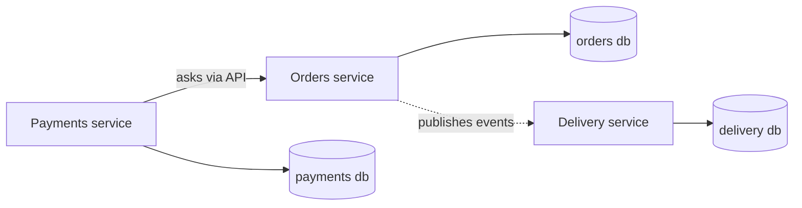
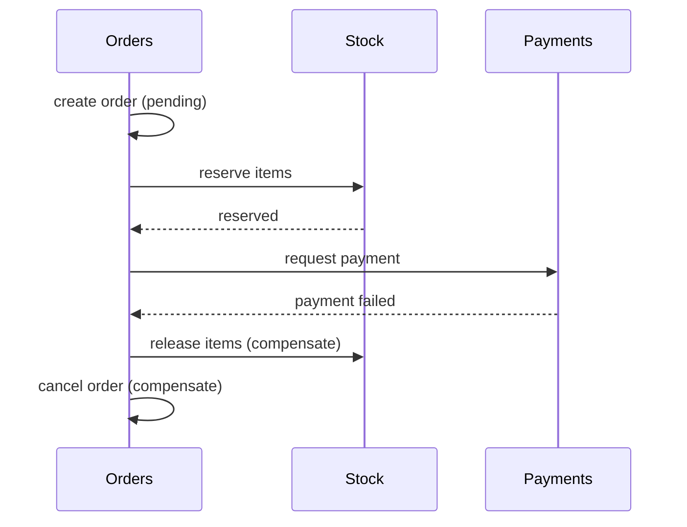
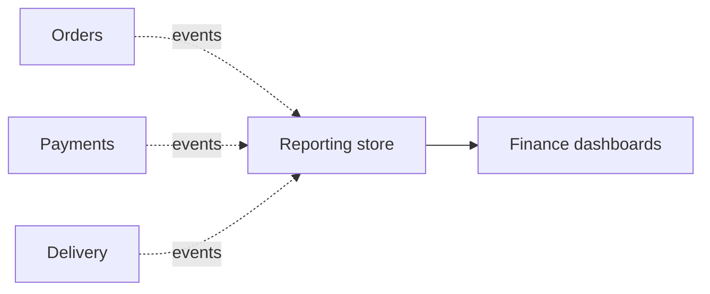

> **Table of Contents:**
>
> - [The Shared Database Trap](#the-shared-database-trap)
> - [One Owner Per Piece of Data](#one-owner-per-piece-of-data)
> - [Asking vs. Keeping a Copy](#asking-vs-keeping-a-copy)
> - [Transactions Don't Cross Boundaries](#transactions-dont-cross-boundaries)
> - [Sagas, in Plain Words](#sagas-in-plain-words)
> - [The Outbox: Don't Lose the Message](#the-outbox-dont-lose-the-message)
> - [Reporting Without Reaching Into Everyone's Tables](#reporting-without-reaching-into-everyones-tables)
> - [Putting It Together](#putting-it-together)

---

## The Shared Database Trap

Back to the Nairobi hardware shop. The team has split the code into an orders service, a payments service, and a delivery service. Progress. But all three still read and write the same database, because that was quicker.

One Tuesday, someone on the orders side renames `orders.phone` to `orders.customer_phone`. Clean, sensible, fully tested on their side. Deploy goes out. Ten minutes later, payments can't match M-Pesa confirmations to orders, delivery can't text riders the customer's number, and the finance report that runs at midnight is going to be very empty.

Nobody did anything wrong in their own code. The problem is that the table was a **public API nobody knew they were publishing**. Every service that queried it had quietly signed a contract with its exact shape.

This is the part of architecture people skip. Splitting code is easy: move files, draw boxes. Splitting data is where the real coupling lives, because data outlives code. You can rewrite a service in a weekend. The rows it wrote will still be there in five years.

---

## One Owner Per Piece of Data

The rule that fixes most of this fits in a sentence: **every piece of data has exactly one owner, and only the owner writes it.**

- The orders service owns orders.
- The payments service owns payments.
- The delivery service owns riders and trips.

Everyone else who needs that data goes *through* the owner, via an API call or by listening to the owner's events. They never read the owner's tables directly.



Now the owner is free to rename columns, split tables, or change databases entirely, as long as the API and events stay the same. The contract is explicit and small, instead of accidental and enormous.

You don't need separate database servers to get this. Separate schemas, or even just a rule that "only the orders module touches `orders_*` tables", enforced in code review or with database permissions, gets you most of the benefit. What matters is ownership, not hardware.

---

## Asking vs. Keeping a Copy

Once data has an owner, other services have two ways to get at it.

**Ask when you need it.** Delivery needs the customer's phone number, so it calls `GET /orders/{id}` on the orders service.

```python
def rider_brief(order_id: str) -> dict:
    order = orders_client.get(order_id, timeout=2.0)
    return {"phone": order["customer_phone"], "address": order["address"]}
```

Simple, always up to date. But delivery now depends on orders being up *right now*. If orders is slow, delivery is slow. If orders is down, riders don't get their briefs.

**Keep a copy.** Delivery listens for `OrderPlaced` events and stores the bits it needs in its own tables.

```python
def on_order_placed(event: dict) -> None:
    delivery_db.upsert("order_contacts", {
        "order_id": event["order_id"],
        "phone": event["customer_phone"],
        "address": event["address"],
    })

def rider_brief(order_id: str) -> dict:
    return delivery_db.get("order_contacts", order_id)   # no network call
```

Now delivery works even if orders is having a bad afternoon. The price is that the copy can lag behind. If a customer updates their address, there's a short window where delivery still has the old one, until the `AddressChanged` event arrives.

Neither choice is always right. A rough guide:

| If the data... | Lean towards |
|---|---|
| must be exactly current (account balance, stock at checkout) | asking the owner |
| changes rarely and is read a lot (names, addresses, product titles) | keeping a copy |
| is needed even when the owner is down | keeping a copy |
| is big, and you only need a little of it | keeping a copy of just that little |

If this sounds familiar, it's the [event-carried state transfer](/blog/library/event-driven-systems) pattern, seen from the point of view of the data.

---

## Transactions Don't Cross Boundaries

Here is where it gets uncomfortable. In one database, placing an order is a single transaction:

```python
with db.transaction():
    db.insert("orders", order)
    db.update("stock", sku=order.sku, change=-order.qty)
    db.insert("payments", {"order_id": order.id, "status": "pending"})
```

Either all three happen or none do. The database guarantees it.

Split orders, stock, and payments into services with their own databases, and that guarantee is gone. There is no transaction that spans three services. You can reserve the stock, then fail to create the payment, and now you have stock locked up for an order that doesn't exist.

The textbook answer is a distributed transaction, a protocol like two-phase commit that makes several databases agree. In practice it's slow, fragile, and most modern databases and message brokers won't take part in one. So instead of pretending the boundary isn't there, you design around it.

---

## Sagas, in Plain Words

A **saga** is a business process broken into steps, where each step is a local transaction in one service, and each step has an **undo**, called a compensation, in case a later step fails.

Checkout as a saga:

1. Orders: create the order as `pending`. *Undo: mark it `cancelled`.*
2. Stock: reserve the items. *Undo: release the reservation.*
3. Payments: ask M-Pesa for the money. *Undo: refund, or just never capture it.*
4. Orders: mark the order `confirmed`.

If step 3 fails because the customer cancels the STK push, you run the undos for steps 2 and 1, in reverse.



In code, the simplest version is one place that runs the steps in order and remembers how to undo them. That style is called **orchestration**:

```python
def place_order(order):
    undo = []
    try:
        orders.create(order, status="pending")
        undo.append(lambda: orders.cancel(order.id))

        stock.reserve(order.id, order.items)
        undo.append(lambda: stock.release(order.id))

        payments.charge(order.id, order.total_kes, order.phone)
        orders.confirm(order.id)
    except Exception:
        for step in reversed(undo):
            step()
        raise
```

The alternative is **choreography**: no coordinator, each service reacts to the previous service's events. `OrderCreated` makes stock reserve, `StockReserved` makes payments charge, `PaymentFailed` makes stock release. It's more decoupled, but the process only exists as a pattern of events spread across services, which is harder to follow and debug. For a handful of steps, orchestration is usually easier to live with.

Two honest caveats. First, between the steps the system is briefly **in between**: the stock is reserved but the order isn't confirmed yet. Your UI and your reports need to be fine with that, which is why "pending" statuses exist. Second, compensations are business decisions, not technical ones. "Undo a payment" might be an instant refund, a manual review, or store credit. Ask the business, not the database.

---

## The Outbox: Don't Lose the Message

Keeping copies and running choreographed sagas both depend on events actually being published. That hides a nasty bug:

```python
def confirm_order(order_id):
    db.update("orders", order_id, status="confirmed")   # 1. save
    broker.publish("OrderConfirmed", {"order_id": order_id})   # 2. announce
```

If the process crashes between line 1 and line 2, the order is confirmed but nobody hears about it. Delivery never dispatches a rider. Swap the lines and it's worse: everyone hears about an order that was never saved.

The **transactional outbox** fixes this by writing the event into the *same database*, in the *same transaction*, as the change itself:

```python
def confirm_order(order_id):
    with db.transaction():
        db.update("orders", order_id, status="confirmed")
        db.insert("outbox", {
            "event": "OrderConfirmed",
            "payload": {"order_id": order_id},
        })
```

A small background worker then reads the outbox and publishes whatever hasn't been sent yet:

```python
def relay_outbox():
    for row in db.query("SELECT * FROM outbox WHERE sent_at IS NULL ORDER BY id LIMIT 100"):
        broker.publish(row.event, row.payload)
        db.update("outbox", row.id, sent_at=now())
```

Now the change and the announcement either both happen or neither does. The relay might publish an event twice if it crashes after publishing but before marking it sent, so listeners need to handle duplicates. That's the [at-least-once](/blog/library/event-driven-systems) trade-off again, and the usual fix is an idempotency check on the receiving side.

---

## Reporting Without Reaching Into Everyone's Tables

The last thing that tempts people back into the shared database is reporting. Finance wants "revenue by delivery zone per week", and that needs orders, payments, and delivery data together. The quick fix is a report that `JOIN`s across everyone's tables. It works, until the next column rename.

The better fix is to give reporting its **own** copy, built from the same events everyone else already publishes:



The reporting store is shaped for questions, not for transactions: wide tables, pre-joined, whatever makes the dashboard fast. It can lag a few minutes behind, which is fine for "revenue this week". And every service stays free to change its own tables, because nothing reaches into them.

---

## Putting It Together

- A shared database turns every table into an accidental public API. That's where most coupling hides.
- **One owner per piece of data.** Only the owner writes it; everyone else goes through the owner's API or events.
- **Ask** the owner when data must be exactly current. **Keep a copy** when it changes rarely or you need it while the owner is down.
- Transactions don't cross service boundaries. Use a **saga**: local steps, each with a compensation, run by an orchestrator or by choreographed events.
- Use a **transactional outbox** so saving a change and announcing it can't get out of step, and make listeners safe against duplicates.
- Build **reporting** from events into its own store, instead of joining across everyone's tables.

Code is the part of a system you can see. Data is the part that remembers. Decide who owns it before you split anything, and most of the other problems get smaller.
