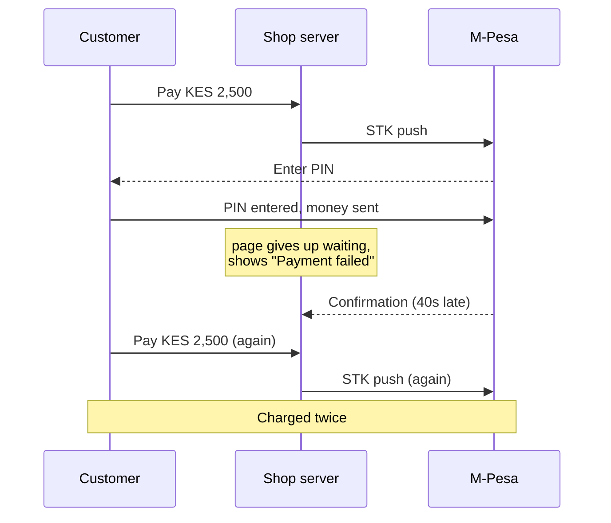
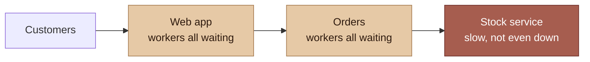
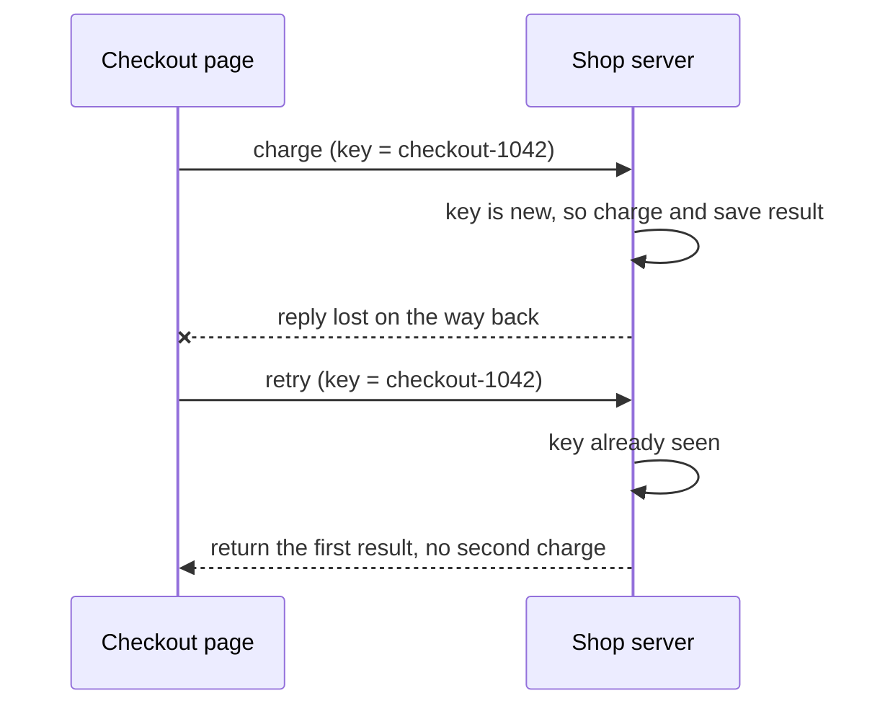
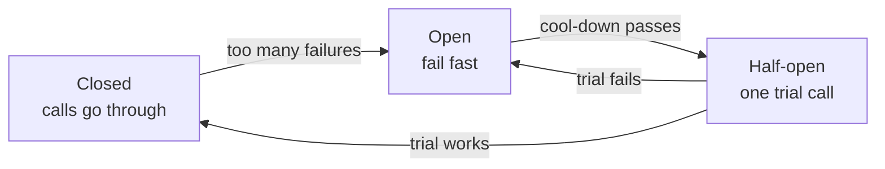
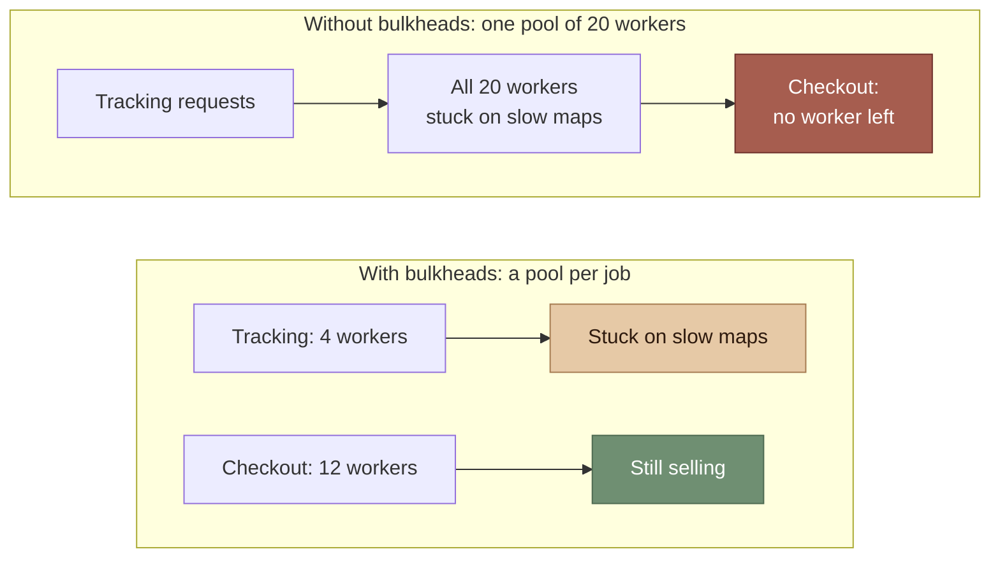

> **Table of Contents:**
>
> - [Everything Fails, Eventually](#everything-fails-eventually)
> - [Timeouts: Decide How Long You'll Wait](#timeouts-decide-how-long-youll-wait)
> - [Retries Without Making It Worse](#retries-without-making-it-worse)
> - [Idempotency: Safe to Do Twice](#idempotency-safe-to-do-twice)
> - [Circuit Breakers: Stop Knocking on a Locked Door](#circuit-breakers-stop-knocking-on-a-locked-door)
> - [Bulkheads: Keep the Leak in One Room](#bulkheads-keep-the-leak-in-one-room)
> - [Degrade, Don't Die](#degrade-dont-die)
> - [Test the Failure Paths](#test-the-failure-paths)
> - [Putting It Together](#putting-it-together)

---

## Everything Fails, Eventually

A customer at the Nairobi hardware shop taps "Pay with M-Pesa". The STK push lands on their phone, they enter their PIN, and the money leaves their account. Then the confirmation callback that's supposed to tell the shop "paid" takes forty seconds to arrive, because somewhere between Safaricom and the shop's server, something is slow. Meanwhile the checkout page has given up and says "Payment failed, please try again."

So the customer tries again. And pays twice.



Nothing in that story was a bug in the usual sense. Every component did what it was written to do. The system just wasn't written for the world it runs in: a world where networks are slow, callbacks arrive late or twice, KPLC takes the power for the afternoon, and the server you depend on is having its own bad day.

Most code is written for the happy path, with failure handled as an afterthought: a `try/except` that logs and moves on. Resilient systems flip that around. They assume every call across a network **will** fail sometimes, and decide ahead of time what should happen when it does.

This chapter is a toolkit for that. None of the tools are complicated. The hard part is remembering to use them before production reminds you.

---

## Timeouts: Decide How Long You'll Wait

The most dangerous number in a network call is the one you didn't choose. Many HTTP clients, including Python's `requests`, will wait **forever** for a response unless you give them a timeout.

```python
# waits forever if the server accepts the connection and then goes quiet
response = requests.get("https://stock-service/items/42")
```

Forever is a problem because waiting isn't free. Each stuck request holds a worker, a connection, and memory. When enough requests are stuck, your service stops answering anyone, and now *you* are the slow dependency for whoever calls you. That's how one sluggish service takes down five others.



The stock service isn't broken, just slow. But with no timeouts, the slowness travels upstream until the customer is the one left waiting.

So every network call gets a timeout, and you choose it deliberately:

```python
# (connect timeout, read timeout) in seconds
response = requests.get("https://stock-service/items/42", timeout=(2, 5))
```

A decent way to pick the number: look at how long the call normally takes when things are healthy, the slowest 1% of responses is a good reference, and set the timeout a bit above that. Then check it against the person waiting. If a customer is staring at a spinner, the *total* time for everything the page needs has to fit inside their patience, and a stack of five-second timeouts adds up quickly.

---

## Retries Without Making It Worse

Lots of failures are brief. A dropped connection, a server restarting, a moment of congestion. Trying again usually works. But retries done carelessly turn a small problem into a big one.

Imagine the stock service hiccups for two seconds. Every caller immediately retries, three times, as fast as it can. The stock service, already struggling, now gets four times its normal traffic, at exactly the moment it can least handle it. The hiccup becomes an outage. This is sometimes called a **retry storm**.

Good retries have three properties:

1. **Only retry what's safe to retry.** A timeout or a `503` is worth another try. A `400 Bad Request` will fail the same way every time.
2. **Wait longer each time.** This is **exponential backoff**: wait 0.5s, then 1s, then 2s.
3. **Add randomness.** This is **jitter**. If a thousand clients all back off by exactly the same amounts, they all retry at the same instant. A random spread smooths the spikes out.

```python
import random, time
import requests

RETRYABLE = {502, 503, 504}

def get_with_retries(url, attempts=4, base=0.5, cap=8.0):
    for attempt in range(attempts):
        try:
            response = requests.get(url, timeout=(2, 5))
            if response.status_code not in RETRYABLE:
                return response
        except (requests.ConnectionError, requests.Timeout):
            pass
        if attempt < attempts - 1:
            # "full jitter": sleep a random amount up to the backoff limit
            time.sleep(random.uniform(0, min(cap, base * 2 ** attempt)))
    raise RuntimeError(f"gave up on {url} after {attempts} attempts")
```

One more rule: **retry in one layer only.** If the browser retries, the API gateway retries, and the service retries, one slow database call can turn into dozens of attempts. Pick the layer closest to the failure and let everyone else fail fast.

---

## Idempotency: Safe to Do Twice

Retries have a catch. Back to the double payment: the first request *did* reach the server and *did* succeed. Only the reply got lost. From the client's side, "the request failed" and "the request worked but I never heard back" look exactly the same. So if retrying means doing the work again, you'll sometimes do it twice.

The fix is to make the operation **idempotent**: doing it twice has the same effect as doing it once. Reading data is naturally idempotent. Setting a value (`status = "shipped"`) is idempotent. Creating a payment is not, unless you make it so.

The standard trick is an **idempotency key**: the client generates a unique ID for the *intent*, "this customer paying for this order", and sends it with every attempt. The server remembers which keys it has already handled.



```python
def charge(order_id: str, phone: str, amount_kes: int, idempotency_key: str):
    existing = db.get("payments_by_key", idempotency_key)
    if existing:
        return existing                      # a retry: hand back the first result

    with db.transaction():
        payment = mpesa.request_stk_push(phone, amount_kes, reference=order_id)
        db.insert("payments_by_key", {"key": idempotency_key, "payment": payment})
    return payment
```

```python
# client side: one key per checkout, reused on every retry
key = f"checkout-{order_id}"
charge(order_id, phone, total, idempotency_key=key)
```

In a real system, two retries can arrive at the same moment, so the `payments_by_key` table should have a unique constraint on `key`. Then the database, not your `if` statement, is what guarantees only one wins.

Idempotency matters just as much for things you *receive*. Payment providers and message brokers often deliver the same callback or event more than once. If "payment confirmed" arrives twice, the second one should be a harmless no-op, not a second rider dispatched.

---

## Circuit Breakers: Stop Knocking on a Locked Door

Retries help with short blips. But if a dependency is properly down for ten minutes, retrying every request just wastes time: each customer waits through every timeout and every backoff, only to fail anyway.

A **circuit breaker** notices when a dependency keeps failing and stops calling it for a while, failing instantly instead. It borrows the idea from the breaker in your house's electrical panel, and it has three states:

- **Closed.** Everything is normal and calls go through. Failures are counted.
- **Open.** Too many recent failures. Calls fail immediately without touching the network.
- **Half-open.** After a cool-down, let one trial call through. If it works, close the breaker. If not, open it again.



A small but complete version:

```python
import time

class CircuitBreaker:
    def __init__(self, max_failures=5, cooldown=30.0):
        self.max_failures = max_failures
        self.cooldown = cooldown
        self.failures = 0
        self.opened_at = None

    def call(self, fn, *args, **kwargs):
        if self.opened_at is not None:
            if time.monotonic() - self.opened_at < self.cooldown:
                raise RuntimeError("circuit open: failing fast")
            # cool-down over: half-open, let this one call through as a trial
        try:
            result = fn(*args, **kwargs)
        except Exception:
            self.failures += 1
            if self.opened_at is not None or self.failures >= self.max_failures:
                self.opened_at = time.monotonic()   # open, or re-open after a failed trial
            raise
        self.failures = 0
        self.opened_at = None                        # success closes the circuit
        return result

recommendations = CircuitBreaker(max_failures=5, cooldown=30)
items = recommendations.call(fetch_recommendations, user_id)
```

Production libraries add more, like counting failures in a rolling time window, but the idea is all here. The breaker protects two parties at once: your users, who get a fast answer instead of a long wait, and the struggling service, which gets a break from the traffic while it recovers.

---

## Bulkheads: Keep the Leak in One Room

Ships are built with **bulkheads**, walls that split the hull into sealed sections. If one section floods, the others stay dry and the ship stays afloat.

Software has the same problem. Say your shop's server has one pool of 20 workers handling everything. The rider-tracking endpoint calls a map service that has become painfully slow. One by one, all 20 workers get stuck waiting on maps. Now checkout, which never touches maps, can't get a worker either. A slow, non-essential feature has sunk the one that makes money.

A bulkhead gives each kind of work its own limited share of resources, so one can't starve the others:



```python
from concurrent.futures import ThreadPoolExecutor

checkout_pool = ThreadPoolExecutor(max_workers=12)   # the money path gets the most
tracking_pool = ThreadPoolExecutor(max_workers=4)    # if maps is slow, only this fills up
reports_pool = ThreadPoolExecutor(max_workers=2)

future = tracking_pool.submit(fetch_rider_location, trip_id)
location = future.result(timeout=3)
```

The same idea works at every scale: separate connection pools per dependency, separate queues per job type, separate servers for the admin dashboard and the customer shop. Ask yourself what the most important thing your system does is, and make sure nothing less important can take its resources.

---

## Degrade, Don't Die

When a dependency fails, "error page" is rarely the only option. Often there's a smaller version of the feature you can still offer. Decide those fallbacks ahead of time, feature by feature:

| When this fails... | Instead of an error, you could... |
|---|---|
| Recommendations | Show best-sellers, or hide the section |
| Live stock count | Show "In stock" from a cached value a few minutes old |
| SMS provider | Queue the message and send it when the provider is back |
| Payment confirmation is slow | Show "Payment received, confirming…" and finish in the background |
| The internet itself | Keep selling offline and sync later |

That last row is not hypothetical. For a till in a Kenyan shop, "the network is down" is a normal Tuesday, not an edge case. In [Building a Desktop POS with Tauri](/blog/writings/pos-with-tauri) the whole design follows from one rule: treat the network as an enhancement to a system that already works without it. That's graceful degradation taken to its logical end.

The pattern behind most of these fallbacks is the same: **separate accepting the work from finishing it.** Take the order, save it locally, say "got it", and let a background job do the part that needs the flaky dependency, retrying calmly until it succeeds.

```python
def send_receipt(order_id: str, phone: str):
    # don't make the customer wait on the SMS provider; queue it
    db.insert("outgoing_sms", {"order_id": order_id, "phone": phone, "status": "queued"})

def sms_worker():
    for sms in db.query("SELECT * FROM outgoing_sms WHERE status = 'queued' LIMIT 50"):
        try:
            sms_provider.send(sms.phone, receipt_text(sms.order_id), timeout=5)
            db.update("outgoing_sms", sms.id, status="sent")
        except Exception:
            pass   # still queued; the next run tries again
```

---

## Test the Failure Paths

Failure handling that's never been exercised usually doesn't work. The timeout is set in the wrong unit, the fallback has a typo, the circuit breaker never actually opens. You find out during the one outage where it mattered.

You don't need a fancy chaos engineering platform to start. A few habits go a long way:

- **Write tests where the dependency fails.** Mock the stock service to time out, return `503`, or return garbage, and assert what the user sees.
- **Add a fault switch in development.** An environment variable that makes a chosen dependency slow or broken, so you can click through the app and watch it degrade.
- **Pull the plug, literally.** For anything that must work offline, disconnect the network in the middle of a sale and see what happens. Then reconnect and check the sync.

```python
def test_checkout_survives_slow_recommendations(monkeypatch):
    def slow(*args, **kwargs):
        raise requests.Timeout("recommendations took too long")
    monkeypatch.setattr(shop.recommendations, "fetch", slow)

    page = client.get("/checkout")

    assert page.status_code == 200            # checkout still works
    assert "Best sellers" in page.text        # and falls back gracefully
```

---

## Putting It Together

- Assume every call across a network **will** fail sometimes, and decide ahead of time what happens when it does.
- **Timeouts** on every call, chosen deliberately. Waiting forever turns someone else's slowness into your outage.
- **Retry** only what's safe, with exponential backoff and jitter, in one layer only.
- Make operations **idempotent** with idempotency keys, so a retry or a duplicate callback can't charge a customer twice.
- **Circuit breakers** fail fast when a dependency is down, protecting both your users and the dependency.
- **Bulkheads** stop a slow, unimportant feature from starving the important ones.
- **Degrade, don't die.** Plan a smaller version of each feature, and separate accepting work from finishing it.
- **Test the failure paths**, because untested failure handling is just optimism.

Networks drop and power goes out. The customer doesn't care whose fault it was, only whether the sale went through, once. Build for the world your software actually runs in, and the bad days become just days.
