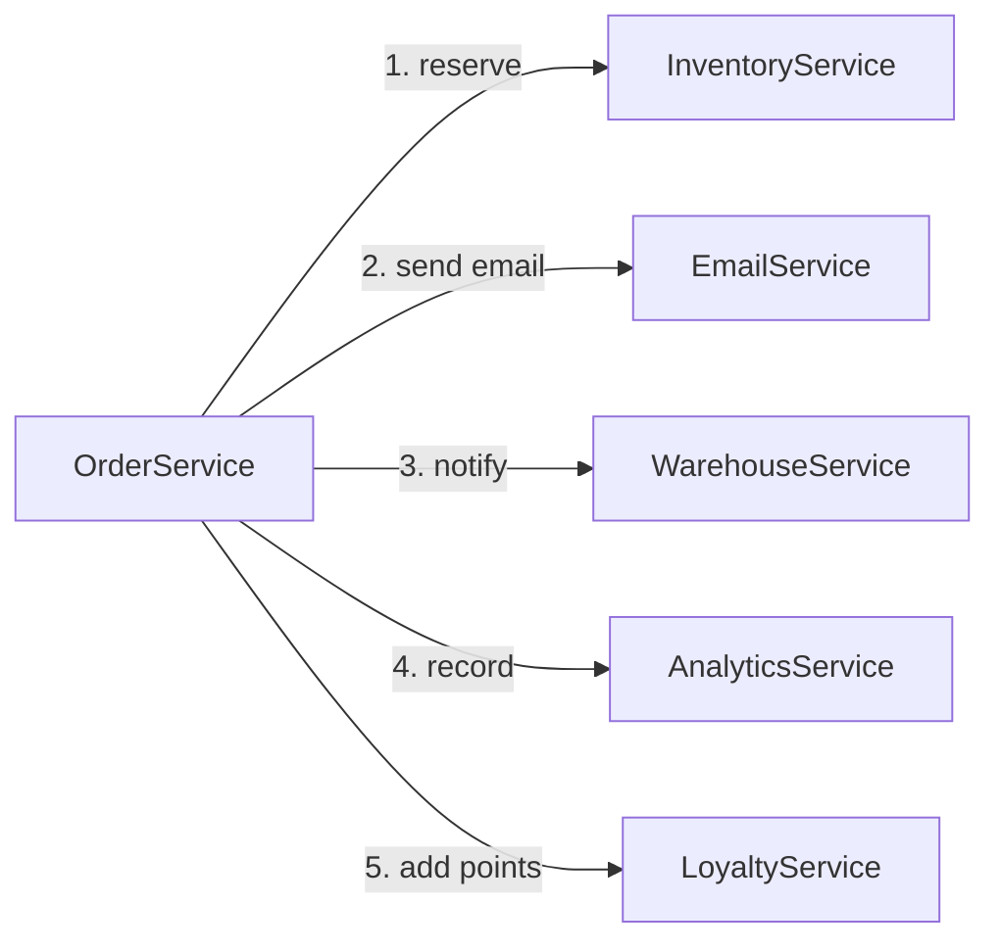
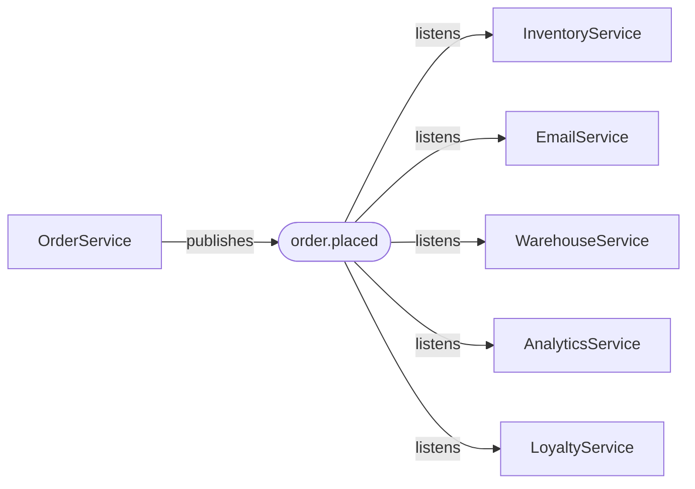
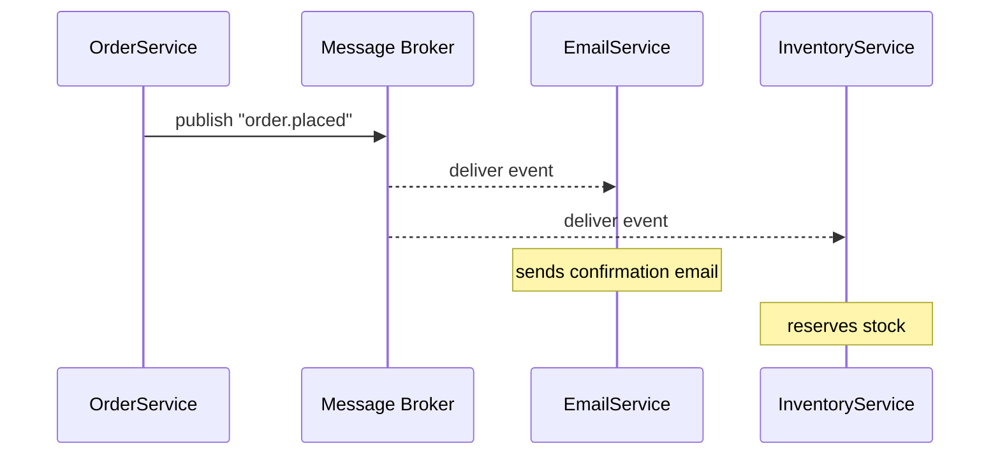
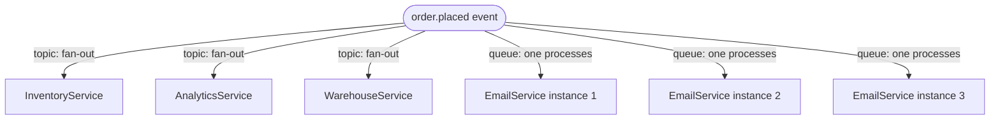

> **Table of Contents:**
>
> - [The Problem With Asking](#the-problem-with-asking)
> - [What Is an Event, Actually](#what-is-an-event-actually)
> - [How the Signal Travels](#how-the-signal-travels)
> - [Patterns You'll Actually Use](#patterns-youll-actually-use)
> - [The Trade-offs Nobody Mentions Upfront](#the-trade-offs-nobody-mentions-upfront)
> - [When Event-Driven Makes Sense](#when-event-driven-makes-sense)

---

## The Problem With Asking

Picture this: a customer places an order on your platform. Here's what needs to happen next:

- Inventory gets reserved
- A confirmation email goes out
- The warehouse gets notified
- Analytics records the sale
- Loyalty points get added

In a typical system, your `OrderService` handles all of this. It places the order, then calls `InventoryService`, then calls `EmailService`, then calls `WarehouseService`, then calls `AnalyticsService`, then calls `LoyaltyService`.



This works. Until `EmailService` is slow and the whole order hangs waiting for it. Until `WarehouseService` is down and the order fails even though it was placed successfully. Until someone adds a sixth thing `OrderService` needs to call, and you're back in that file again adding another line.

Most people think this is just the cost of building features. It's not — it's the cost of building a system where everything *asks* instead of *listens*.

Here is where it gets interesting: what if `OrderService` didn't have to know any of those other services exist?

---

## What Is an Event, Actually

An event is just a fact. Something happened. It's not a request — it's not asking anyone to do anything. It's a record of reality.

```python
# This is not an event — it's a command
send_confirmation_email(order)

# This is an event — it's a fact
{
    "event": "order.placed",
    "order_id": "ord_8f3k2",
    "user_id": "usr_991a",
    "total": 4200,
    "timestamp": "2026-06-15T10:42:00Z"
}
```

The difference matters. A command assumes someone is there to receive it and knows what to do. An event just says what happened — whoever cares can listen, whoever doesn't can ignore it.

`OrderService` publishes `order.placed` and moves on. It doesn't wait. It doesn't check. It doesn't care what happens next. That's someone else's job.



Adding a sixth service? It subscribes to `order.placed`. `OrderService` never changes. Never even knows.

---

## How the Signal Travels

The thing that sits in the middle — between the publisher and the subscribers — is called a **message broker**. Think of it as a post office. Publishers drop letters off. Subscribers pick them up. The post office doesn't care what's in the letters, it just makes sure they get delivered.



Popular brokers: **Kafka** (high throughput, keeps events for a configurable time), **RabbitMQ** (simpler, good for task queues), **Redis Streams** (lightweight, already in your stack), **AWS SNS/SQS** (managed, zero ops).

The broker gives you two things that direct calls never could:

**Durability.** If `EmailService` is down when the event fires, the broker holds the event. When the service comes back up, it processes it. The order didn't fail — the email was just delayed.

**Decoupling.** Publishers and subscribers don't know each other exist. You can add, remove, or rewrite a subscriber without touching the publisher.

### Topics and Queues

Two ways events get routed:

**Topic (pub/sub)** — one event, many subscribers all get a copy. `order.placed` goes to Inventory, Email, Analytics, all of them simultaneously.

**Queue (competing consumers)** — one event, one subscriber processes it. If you have three instances of `EmailService` running, only one of them sends the confirmation email. The queue distributes the work.



In practice you often use both — fan out to multiple services with a topic, then within each service use a queue to distribute load across instances.

---

## Patterns You'll Actually Use

### Event Notification

The simplest pattern. "Something happened, here's the ID, go look it up if you care."

```python
# Publisher
await broker.publish("order.placed", {
    "order_id": "ord_8f3k2",
    "timestamp": "2026-06-15T10:42:00Z"
})

# Subscriber — goes and fetches what it needs
async def on_order_placed(event):
    order = await order_service.get(event["order_id"])
    await send_confirmation(order.user_email, order)
```

Lean payload. Subscribers fetch what they need. The downside: subscribers need to make an extra call to get the data. If the order service is slow, that ripples through.

### Event-Carried State Transfer

The event carries everything subscribers need. No extra calls required.

```python
await broker.publish("order.placed", {
    "order_id": "ord_8f3k2",
    "user_id": "usr_991a",
    "user_email": "user@example.com",
    "items": [
        {"sku": "BOOT-42", "qty": 1, "price": 4200}
    ],
    "total": 4200,
    "delivery_address": "Ongata Rongai, Kajiado",
    "timestamp": "2026-06-15T10:42:00Z"
})
```

Subscribers are fully autonomous — they don't need to call back to get data. The trade-off: the event is heavier, and if your data model changes, every subscriber that relied on a field needs to be updated.

### Event Sourcing

Here is where it gets interesting: what if instead of storing the current *state* of something, you stored every *event* that led to that state?

Most people think of a database as "the current truth." Event sourcing flips that. The events are the truth. The current state is just a projection you compute from replaying them.

```python
# Traditional: store current state
orders_table = {"ord_8f3k2": {"status": "delivered", "total": 4200}}

# Event sourcing: store what happened
event_log = [
    {"event": "order.placed",    "order_id": "ord_8f3k2", "total": 4200},
    {"event": "order.confirmed", "order_id": "ord_8f3k2"},
    {"event": "order.shipped",   "order_id": "ord_8f3k2", "courier": "DHL"},
    {"event": "order.delivered", "order_id": "ord_8f3k2"},
]

# Current state is derived by replaying the log
def get_order_state(order_id):
    events = [e for e in event_log if e["order_id"] == order_id]
    return reduce(apply_event, events, {})
```

You get a complete audit trail for free. You can replay history to rebuild state. You can project the same events into different read models.

The cost: it's a different way of thinking about data, and querying "what's the current state of this order?" requires an extra step. It's not the right tool for everything — but for systems where audit history matters (payments, healthcare, compliance), it's very powerful.

---

## The Trade-offs Nobody Mentions Upfront

Event-driven architecture has a reputation for being elegant. It is. It also introduces problems that don't exist in direct-call systems.

### Debugging gets harder

In a direct-call system, a failure has a stack trace. You know exactly where it broke.

In an event-driven system, `OrderService` published an event, and two seconds later `InventoryService` failed processing it. The logs are in different services, the error is in a different process, and tracing what happened requires correlating events across multiple log streams.

The fix is **distributed tracing** — attaching a `correlation_id` to every event so you can follow a request across service boundaries.

```python
await broker.publish("order.placed", {
    "order_id": "ord_8f3k2",
    "correlation_id": "trace_7a8b9c",  # same ID across all downstream events
    ...
})
```

### Eventual consistency

When `OrderService` publishes an event and returns a 200 to the user, the inventory hasn't been reserved yet. The email hasn't been sent yet. The warehouse hasn't been notified yet.

Those things will happen — but not immediately. Your system is **eventually consistent**, not immediately consistent.

Most of the time this is fine. A 200ms delay on reserving stock is invisible to the user. But if you need "the inventory is definitely reserved before I confirm the order," events aren't the right tool for that step. Use a direct call, a saga, or a transaction.

### At-least-once delivery

Most brokers guarantee that an event will be delivered *at least once*. Which means it might be delivered *twice*. Network hiccup, retry, same event processed again.

Your subscribers need to handle this — they need to be **idempotent**. Processing the same event twice should produce the same result as processing it once.

```python
async def on_order_placed(event):
    order_id = event["order_id"]

    # Check if we already processed this
    if await already_processed(order_id):
        return  # silently skip, not an error

    await reserve_inventory(order_id)
    await mark_processed(order_id)
```

It's not complicated — but you have to think about it, and forgetting means duplicate emails, double charges, or double-reserved stock.

---

## When Event-Driven Makes Sense

Not every system needs this. A CRUD app with three endpoints doesn't need a message broker. Adding one would be complexity theater.

Event-driven starts earning its keep when:

**Multiple things need to react to the same action.** If placing an order triggers five downstream operations, direct calls mean five dependencies in one service. Events mean zero.

**Those reactions can be delayed.** If sending a confirmation email can happen 500ms after the order is placed — and it almost always can — events handle that naturally. If the warehouse notification can wait a second — it can — events are fine.

**You want services to evolve independently.** A new team wants to build a fraud detection service that listens to `order.placed`. With events, they subscribe and ship. Without events, they ask you to add a call to `OrderService`, wait for a review, wait for a deploy.

**You need audit history.** Events are naturally a log. What happened, in what order, to what entity. That's free with event sourcing, and expensive to retrofit into a state-based system.

---

The mental shift with event-driven systems is going from "I'll tell you what to do" to "I'll tell you what happened." It sounds small. The architectural consequences are significant.

Services stop depending on each other's availability. Features stop requiring changes in unrelated places. The system starts resembling how things actually work in the real world — things happen, and whoever cares reacts.

The complexity moves from the connections between services to the events themselves. Design those well, and the rest tends to follow.