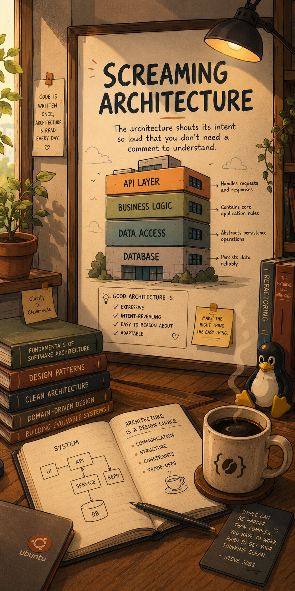
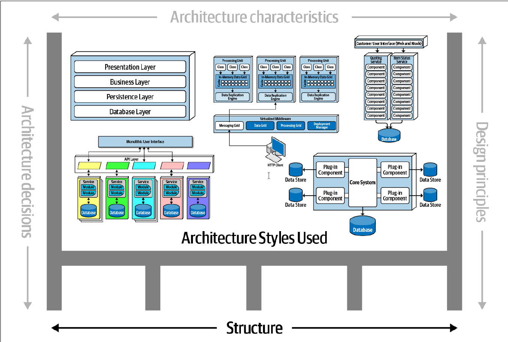

> **Table of Contents:**
>
> - [Why Software Architecture is important](#why-software-architecture-is-important)
> - [Laws of Software Architecture](#laws-of-software-architecture)
> - [Everything is a Trade-Off](#everything-is-a-trade-off)
> - [Why is more important than how.](#why-is-more-important-than-how.)
> - [Modularity](#modularity)
> - [Architecture](#architecture-characteristics-defined)
> - [Component Based Thinking](#component-based-thinking)

# Why Software Architecture is important

`Screaming Architecture` was a term initially coined by Uncle Bob (Robert C. Martin). It is a design principle stating that a software system's structure should immediately and clearly communicate its business domain and purpose, rather than its underlying technical framework or tools.

Software Architecture comes in many dimensions. Some people tend to define it as the blueprint of the system others tend to refer to it as the roadmap of the system. The issue with such definition they really do not capture fully what Software Architecture is.

Others tend to define it in terms of the structure such as `monolithic`, `layered`, `plug-in`, `client-server` systems.

Others in terms of Architectural characteristics such as `scalability`, `maintainability`, `performance`, `security` and so on.

All this aspects cover a fragment of what Software Architecture is. The truth is that Software Architecture is a combination of all these aspects and more.
It is the overall structure and organization of a software system, encompassing its components, their interactions, and the principles guiding its design and evolution.

A `Big Ball of Mud` is the term used to describe a software system that lacks a clear and modular architecture, resulting in a tangled and unmaintainable codebase. It is often characterized by a lack of separation of concerns, where different functionalities are intertwined and interdependent, making it difficult to understand, modify, or extend the system without introducing bugs or unintended consequences.

With both extremes in mind, we can view many software systems as existing somewhere along a spectrum between these two ends. 
Most Software Engineers aspire to build systems whose structure clearly communicates their intent, yet the realities of changing requirements, deadlines, and technical debt often pull systems toward the characteristics of a Big Ball of Mud.
This does not necessarily mean the software has failed; rather, it reflects the practical trade-offs of software development. 
The important thing is to recognize these forces, understand where a system currently sits on the spectrum, and continuously steer it toward greater clarity, maintainability, and architectural integrity.