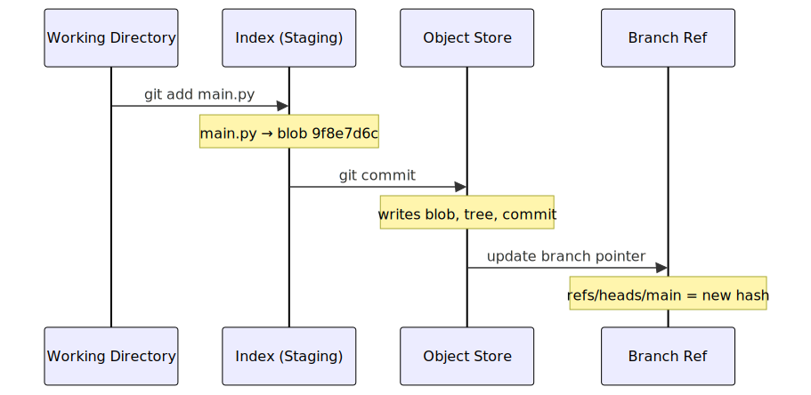

> **Table of Contents:**
>
> - [Git Is Not What You Think It Is](#git-is-not-what-you-think-it-is)
> - [The .git Folder: Everything Git Knows](#the-git-folder-everything-git-knows)
> - [The Four Objects](#the-four-objects)
> - [What Actually Happens When You Commit](#what-actually-happens-when-you-commit)
> - [Branches Are Just Text Files](#branches-are-just-text-files)
> - [The Staging Area Is a Real Thing](#the-staging-area-is-a-real-thing)
> - [Merging vs Rebasing, From the Inside](#merging-vs-rebasing-from-the-inside)
> - [What git reset Actually Does](#what-git-reset-actually-does)

---

## Git Is Not What You Think It Is

Most developers think of git as a "track changes" tool. You make changes, you commit them, you push them somewhere. It records what you did. Undo when needed.

That mental model works fine — until something goes wrong, or you want to do something non-trivial, and suddenly you're staring at a `git rebase --onto` command you found on Stack Overflow — or ChatGPT, no judgment — holding your breath and hoping it doesn't destroy a week of work.

Here is where it gets interesting: git isn't actually a version control system at its core. It's a **key-value store** — basically a simple database where you put content in, and get back a unique ID for it. That's the foundation. Everything else — commits, branches, history — is just a thin layer on top of that.

Once that clicks, a lot of git's "weird" behavior stops feeling weird.

---

## The .git Folder: Everything Git Knows

When you run `git init`, git creates a `.git` folder. That folder *is* your repository. Not metadata, not a pointer — the whole thing.

```bash
$ git init my-project
$ ls my-project/.git

HEAD
config
objects/
refs/
```

Picture this like a filing cabinet. The drawers are:

- **`objects/`** — every file, directory snapshot, and commit ever recorded. This is the database.
- **`refs/`** — your branches and tags. Just files with a commit ID written on them.
- **`HEAD`** — a file that says "you are here."

And the wild part? You can read most of this with `cat`.

```bash
$ cat .git/HEAD
ref: refs/heads/main

$ cat .git/refs/heads/main
a1b2c3d4e5f6a1b2c3d4e5f6a1b2c3d4e5f6a1b2
```

`HEAD` points to a branch. The branch points to a commit hash. That's your entire current position in history — two text files pointing at each other.

---

## The Four Objects

Here is where it gets interesting. Everything git stores is one of four types: a **blob**, a **tree**, a **commit**, or a **tag**.

Most people think git stores diffs — the changes between versions. It doesn't. It stores *snapshots*. Every commit is a full picture of your project at that moment, not a list of what changed. The diff you see in `git show` is computed on the fly by comparing two snapshots.



**Blob** — raw file content. No filename, no path. Just the bytes. If two files in different folders happen to be identical, git stores one blob and points to it twice. Free deduplication.

**Tree** — a directory listing. Maps filenames to blob hashes. This is how git knows that `README.md` is blob `3a4b5c6d`.

**Commit** — points to a tree (the snapshot), a parent commit, and stores your message and author info.

**Tag** — a named pointer to a commit, with an optional message. Mostly used for releases.

The key insight: each object's ID is a hash of its content. Same content = same hash, always. This is what makes git trustworthy — you literally cannot have two different files with the same ID.

---
### "Wait — a full snapshot every commit? Isn't that huge?"
 
Good instinct. The answer is: not really, and here's why.
 
Remember that blobs store *content*, not filenames. So if you commit 50 files and only change one of them, git writes exactly one new blob. The other 49 already exist in the object store — the new tree just points to the same blobs as before. No duplication.
 

 
`README.md` and `utils.py` didn't change — both commits point to the exact same blobs. Git stored them once.
 
On top of that, git periodically runs **packfiles** — it compresses similar objects together and stores only the deltas between them, similar to what you'd expect from a diff-based system. So your `.git` folder stays surprisingly lean even on long-lived projects.
 
The snapshot model buys you simplicity and speed. The storage efficiency is handled quietly in the background.
 
---

## What Actually Happens When You Commit

Picture this: `git add` and `git commit` are two separate jobs, and once you see what each one does, you'll never be confused about the staging area again.

When you run `git add main.py`:

1. Git hashes the file content → writes a blob to `.git/objects/`
2. Git notes in the **index**: "main.py lives at blob `9f8e7d6c`"

That's it. The file is now tracked but not committed.

When you run `git commit`:

1. Git builds **tree objects** from the index (one per directory)
2. Git writes a **commit object** pointing to the root tree + the previous commit
3. Git updates your branch — just overwrites that text file with the new commit hash



A commit is just: some blobs, some trees, one commit object, one file update. The whole thing is just files pointing at other files.

---

## Branches Are Just Text Files

Most people treat branches like they're a big deal — a structural thing, something git has to work hard to maintain.

Here is where it gets interesting: a branch is a file. One file. Containing one line. A commit hash.

```bash
$ cat .git/refs/heads/main
a1b2c3d4e5f6a1b2c3d4e5f6a1b2c3d4e5f6a1b2

$ cat .git/refs/heads/feature/auth
9f8e7d6c5b4a3f2e1d0c9b8a7f6e5d4c3b2a1f0
```

Creating a branch = creating a file. Deleting a branch = deleting a file. Switching branches = updating `HEAD` + swapping your working directory to match.


When you commit on `main`, git just overwrites that 41-byte file with a new hash. That's the branch "moving forward."

This is why git branches are instant and free. There's no copying. No restructuring. You're creating a text file.

---

## The Staging Area Is a Real Thing

Picture this: you're packing boxes before a move. Your staging area is the box you're currently filling. You decide what goes in before you seal it.

That's exactly what git's index is. It sits between your working directory and your commit history:

```
Working Directory       Index (Staging)         Repository
─────────────────       ───────────────         ──────────
your actual files  →    what will be committed  → committed history
                  git add                  git commit
```

Most people treat `git add .` as a meaningless ritual before committing. But the index is what lets you do things like:

- Change three files, commit only one
- Stage part of a file with `git add -p`
- Build a clean commit out of messy work-in-progress changes

`git status` is just showing you two diffs at once:

```bash
$ git status
Changes to be committed:        # index vs last commit
  modified: main.py

Changes not staged for commit:  # working dir vs index
  modified: README.md
```

`README.md` is modified in your folder but not in the index — it won't make it into the next commit. `main.py` is already staged and ready to go.

---

## Merging vs Rebasing, From the Inside

Most people think merge and rebase are just two ways to combine work — personal preference, style, whatever. Pick one.

Here is where it gets interesting: they produce fundamentally different histories, and once you see why, you'll know when to use each.

Say you've been working on a `feature` branch while `main` moved on without you:



### Merge

`git merge feature` from `main` finds the common ancestor (C2), combines the changes from both sides, and creates a **merge commit** with two parents.



History is honest. You can see exactly when two lines of work came together.

### Rebase

`git rebase main` from `feature` does something different. Picture this: it picks up your commits (C3, C4) and **replays them on top of the current main** (C5). It creates brand new commit objects — C3' and C4' — with new hashes.



The result looks like you built your feature on top of the latest main all along. Clean, linear history.

The catch: rebase **rewrites commits**. C3 and C4 no longer exist — C3' and C4' replaced them. If someone else already pulled C3 and C4, their copy won't match yours and the next merge gets messy.

The rule that actually sticks: **rebase your own local work before merging. Merge shared branches.**

---

## What git reset Actually Does

`git reset` has a reputation for being dangerous and confusing. It's neither, once you know what it's moving.

Git tracks three things: the commit history, the index, and your working directory. `git reset` moves the current branch pointer to a different commit. The three modes just control how far that change ripples.

### `--soft` — move the pointer, touch nothing else

```
Before: HEAD → C3, index = C3, working dir = C3
After:  HEAD → C2, index = C3, working dir = C3
```

Everything from C3 is now staged and ready to commit again. Use this when you committed too early and want to redo the commit message or split it up.

### `--mixed` — move the pointer, reset the index (default)

```
Before: HEAD → C3, index = C3, working dir = C3
After:  HEAD → C2, index = C2, working dir = C3
```

Your changes are still in your files — they're just unstaged now. Most common use: "undo the last commit but keep my changes."

### `--hard` — move everything

```
Before: HEAD → C3, index = C3, working dir = C3
After:  HEAD → C2, index = C2, working dir = C2
```

Your working directory is reset to match C2. Changes from C3 are gone from your files.

Here is where it gets interesting: they're not actually gone from git. The commit object still exists in `.git/objects` — nothing points to it anymore, but it's there. `git reflog` tracks everywhere HEAD has been, even for commits with no branch pointing to them:

```bash
$ git reflog
a1b2c3d HEAD@{0}: reset: moving to HEAD~1
f7e8d9c HEAD@{1}: commit: Add order validation logic

# ran git reset --hard by mistake? get back with:
$ git reset --hard f7e8d9c
```

This is why the saying "git never loses data" holds up. As long as you committed something, it's in the object store. Reflog is the time machine.

---

## The Bigger Picture

Once you see git as a content-addressable store with text files pointing at each other, a few things fall into place:

**Why cloning is fast.** You're just copying the object store. Git doesn't reconstruct history — it ships the same blobs, trees, and commits verbatim.

**Why branches are instant.** A branch is a 41-byte file. Creating and deleting them is nothing.

**Why `git reflog` saves you.** Commits are immutable objects. Reset, rebase, amend — none of these delete objects. They just move pointers. The old stuff is still there until garbage collection runs weeks later.

**Why merge conflicts are where they are.** Git compares both branches against their common ancestor. If both sides changed the same line in different ways since they split — git genuinely cannot know which is right. That's not a git failure. That's an honest ambiguity.

The commands you use every day are just a thin interface on top of a pretty elegant filing system. Once you can picture the objects and the refs, things like `rebase`, `reset`, and `cherry-pick` stop being scary — they're just obvious operations on a data structure you understand.

And when something breaks — which it will — you'll know exactly where to look.