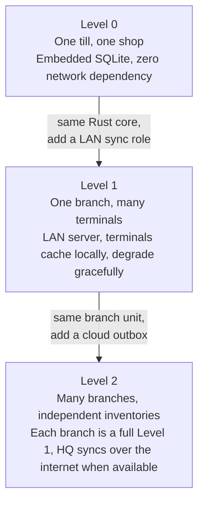
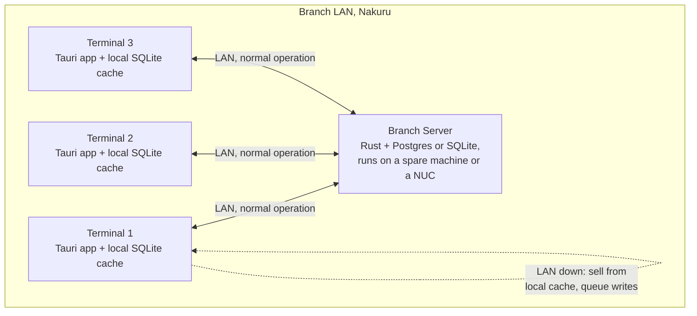
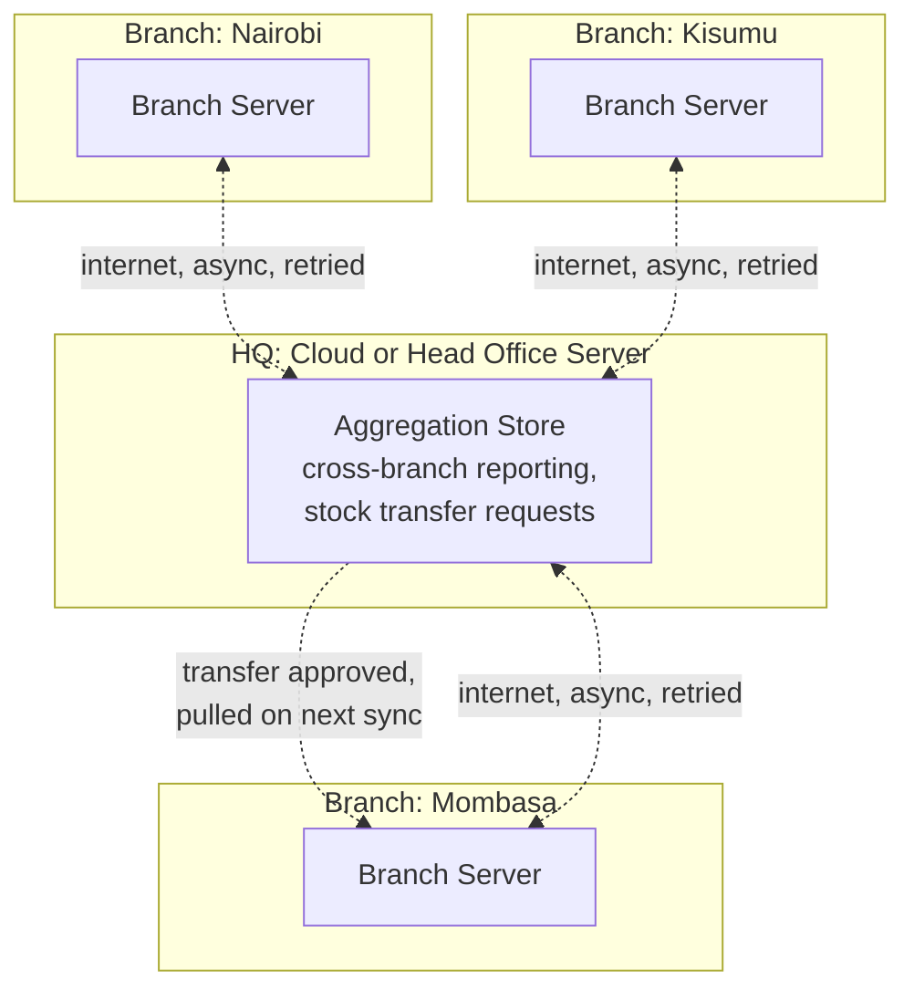
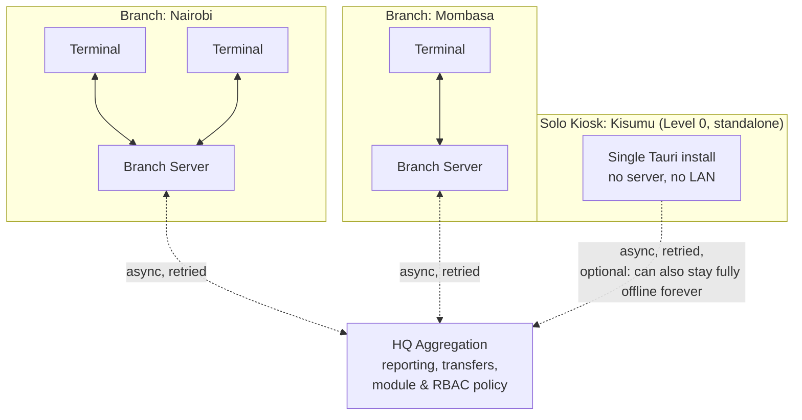

> **Table of Contents:**
>
> - [Why a Desktop POS, and Why It Has to Survive Kenya](#why-a-desktop-pos-and-why-it-has-to-survive-kenya)
> - [Three Levels, One Codebase](#three-levels-one-codebase)
> - [Level 0: One Till, One Shop](#level-0-one-till-one-shop)
> - [Level 1: One Branch, Several Terminals](#level-1-one-branch-several-terminals)
> - [Level 2: Several Branches, Independent Inventories](#level-2-several-branches-independent-inventories)
> - [Offline-First Isn't a Feature, It's the Foundation](#offline-first-isnt-a-feature-its-the-foundation)
> - [The Blackout Problem: What "Sales Must Continue" Actually Requires](#the-blackout-problem-what-sales-must-continue-actually-requires)
> - [RBAC: Roles That Exist on a Kenyan Shop Floor](#rbac-roles-that-exist-on-a-kenyan-shop-floor)
> - [Inventory, End to End: What One POS Should Let You See](#inventory-end-to-end-what-one-pos-should-let-you-see)
> - [The Sync Engine: Getting Data Home Without Losing a Sale](#the-sync-engine-getting-data-home-without-losing-a-sale)
> - [Modules: What's Core, What's Optional, and How You Swap Them](#modules-whats-core-whats-optional-and-how-you-swap-them)
> - [Hardware: Printers, Drawers, Scanners, Scales](#hardware-printers-drawers-scanners-scales)
> - [Deploying and Updating Branches Without Reliable Internet](#deploying-and-updating-branches-without-reliable-internet)
> - [Putting the Three Levels on One Diagram](#putting-the-three-levels-on-one-diagram)
> - [What This Costs, and When It's Worth It](#what-this-costs-and-when-its-worth-it)

---

## Why a Desktop POS, and Why It Has to Survive Kenya

Walk into a mid-sized supermarket in Nairobi's outskirts, a hardware shop in Nakuru, or a pharmacy in Kisumu, and you'll find the same three problems stacked on top of each other. KPLC will cut power without warning, sometimes for the whole afternoon. The fiber line, if there is one, will drop to a 4G hotspot that itself struggles the moment a matatu stage's worth of phones hit the same tower. And the owner, who is usually also the accountant, wants to know exactly how much stock is sitting in the branch across town, right now, without calling anyone.

A cloud-only POS treats every one of these as an edge case to apologize for. A till that freezes because the internet blinked is not a minor bug in this market, it's the difference between a sale happening and a customer walking to the shop next door. So the requirement isn't "add offline support later." The requirement is that the system is built offline-first from the schema up, and everything else, the cloud sync, the head-office dashboard, the multi-branch reporting, is layered on top of a machine that already works standalone.

This is where Tauri earns its place. A Tauri app is a Rust binary with a WebView front end: no bundled Chromium, a few megabytes on disk, and, more importantly for this use case, a Rust core that can own an embedded SQLite database, talk to a receipt printer over serial or USB, and keep running a full sale-and-receipt cycle with zero network calls in the critical path. The browser tab your competitor's cloud POS runs in cannot do any of that. It needs a server to be alive.

This article works through the same architecture at three scales: a single till for one shop, a branch with several terminals sharing a local server, and a small chain with multiple branches that each hold their own inventory but need to be visible from one place. The point isn't that you build three different products. It's that the same domain model, the same offline-first data layer, and the same module system stretch across all three without a rewrite at any step.

---

## Three Levels, One Codebase

Before the detail, the shape of the argument:



Every level up adds a network boundary, never removes one. Level 0 has no network dependency at all. Level 1 adds a LAN, which can go down without the shop stopping. Level 2 adds the internet, which can go down without the branch stopping. The design principle that makes this possible is simple to state and genuinely hard to build: **every terminal, at every level, must be able to complete a sale using only what's on its own disk.** Everything above that is convenience, reporting, and reconciliation, not a dependency for ringing up a customer.

---

## Level 0: One Till, One Shop

This is the starting point most Kenyan SMEs actually need, and it's tempting to treat it as a "simple version" of the real product. It isn't. Get the data model right here and levels 1 and 2 become additive; get it wrong and you'll be rewriting the schema under a business that's already live.

A single Tauri install owns everything: the React front end for ringing up sales, a Rust core, and an embedded SQLite database via `sqlx` or `rusqlite`. No server process, no LAN, nothing to configure beyond installing the app on one machine.

```rust
// src-tauri/src/db/schema.sql (conceptual)
CREATE TABLE products (
    id            TEXT PRIMARY KEY,       -- UUID, generated client-side
    sku           TEXT UNIQUE NOT NULL,
    name          TEXT NOT NULL,
    unit_price    INTEGER NOT NULL,        -- store KES in cents, never floats
    tax_rate      REAL NOT NULL DEFAULT 0.16,
    updated_at    TEXT NOT NULL
);

CREATE TABLE stock_levels (
    product_id    TEXT NOT NULL REFERENCES products(id),
    branch_id     TEXT NOT NULL,           -- 'default' at Level 0
    quantity      INTEGER NOT NULL,
    reorder_point INTEGER NOT NULL DEFAULT 0,
    PRIMARY KEY (product_id, branch_id)
);

CREATE TABLE sales (
    id            TEXT PRIMARY KEY,
    terminal_id   TEXT NOT NULL,
    cashier_id    TEXT NOT NULL,
    total         INTEGER NOT NULL,
    payment_method TEXT NOT NULL,          -- cash, mpesa, card
    mpesa_ref     TEXT,
    synced_at     TEXT,                    -- NULL until it reaches the branch/HQ store
    created_at    TEXT NOT NULL
);
```

Two decisions made here look small and matter for every level that follows.

**`branch_id` exists even when there's only one branch.** A single-shop owner today is a two-branch owner in eighteen months once the business does well, and retrofitting a branch column onto a schema that never had one means touching every query in the codebase. Put it in from day one, default it to `"default"`, and Level 2 becomes a matter of adding rows, not migrating tables.

**`synced_at` exists even when there's nothing to sync to.** It costs one nullable column at Level 0. At Level 1 and 2 it becomes the backbone of the sync engine, described later. A sale row that's `synced_at IS NULL` is a sale that hasn't left this machine yet, and that's true whether "leaving this machine" means reaching a LAN server or a cloud API.

At this level the entire sale flow, scan or search a product, add to cart, take payment, print a receipt, decrement stock, is one local transaction. No `invoke()` call in that path touches the network. Money in Kenya moves largely through M-Pesa, and the STK Push flow (the prompt that pops up on a customer's phone) does need internet, so that specific payment method degrades gracefully to "enter the M-Pesa reference number manually once the customer pays via till number" when offline. Cash and manual M-Pesa entry never depend on connectivity at all.

---

## Level 1: One Branch, Several Terminals

The business grows: three checkout counters at a supermarket branch, or a hardware shop with a counter till and a separate one for the yard. Now the terminals need to agree on stock (two cashiers shouldn't both sell the last bag of cement) and on who's on shift. That requires a shared source of truth on the local network.



The branch server is not a cloud service. It's the same Rust codebase as the terminal, compiled to run headless (no WebView, just the command and sync layer) on whatever machine is available, often the back-office PC that already exists. It owns the authoritative stock count for the branch and brokers writes between terminals so two cashiers can't both decrement the last unit into negative stock.

The interesting design decision is what happens to a terminal when the LAN drops, because in a building with old wiring and a router that reboots itself twice a day, it will. The terminal doesn't stop selling. It falls back to the same embedded SQLite it would use at Level 0, keeps a durable queue of everything that happened while disconnected, and reconciles once the server is reachable again.

```rust
#[tauri::command]
async fn complete_sale(
    sale: SaleInput,
    state: State<'_, AppState>,
) -> Result<SaleReceipt, PosError> {
    // Always write locally first. This never blocks on the network.
    let local_sale = state.db.record_sale(&sale).await?;
    state.db.decrement_local_stock(&sale.line_items).await?;

    // Best-effort push to the branch server; failure is not an error to the cashier.
    match state.branch_link.try_push(&local_sale).await {
        Ok(_) => state.db.mark_synced(&local_sale.id).await?,
        Err(_) => state.outbox.enqueue(&local_sale).await?, // durable, retried in background
    }

    print_receipt(&local_sale).await?;
    Ok(local_sale.into_receipt())
}
```

The cashier never sees a spinner waiting on the branch server. `try_push` either succeeds quickly on a healthy LAN or fails fast and hands the sale to a background outbox that retries with backoff. The receipt prints either way, because the printer is a local device, not a service call.

Stock consistency across terminals when the LAN is up is a straightforward reservation pattern: a terminal asks the branch server to reserve N units before finalizing a sale, and the server is the only writer that can push stock below zero into an oversell state (rare, and reconciled by a supervisor, not silently allowed). When the LAN is down, each terminal sells against its last-known local stock snapshot, which means a genuine risk of overselling the very last unit of something during an outage. That risk is real, it's also strictly better than the alternative of a till that refuses to sell anything until the network returns, and it's the same tradeoff every offline-capable POS in the world makes, cloud vendors included, they just don't advertise it.

---

## Level 2: Several Branches, Independent Inventories

Now the business has a shop in Nairobi, one in Mombasa, and one in Kisumu. Each branch has its own stock. A shirt that's out at the Nairobi branch might have twelve units sitting in Mombasa, and the owner wants to see that from their phone or laptop without calling either branch manager.

The key architectural move at this level is that **a branch is not a client of head office, it's a peer that happens to sync with head office.** Each branch is a complete, self-sufficient Level 1 unit: its own server, its own terminals, its own authoritative stock. Head office (HQ) is a separate node that every branch syncs to when the internet is available, and HQ's dashboard is a read-mostly aggregate view built from what's synced in, not a system any branch depends on to function.



Notice the dotted lines. Every connection above the branch level is asynchronous and retried, never a request a cashier or even a branch manager is blocked on. If Mombasa's internet is out for three days (not unusual outside the main towns), Mombasa keeps selling, keeps managing its own stock, keeps printing receipts, and simply accumulates a backlog of unsynced records that HQ picks up once the line is back. Nothing about ringing up a sale in Mombasa depends on Nairobi, HQ, or the internet existing.

Stock transfers between branches are the one place where cross-branch state genuinely needs coordination, and they're modeled as their own workflow rather than a live query: Nairobi requests 20 units of a SKU from Mombasa, that request syncs to HQ (or directly branch-to-branch if both are online), Mombasa's manager approves and marks units as "in transit" (removed from Mombasa's sellable stock, not yet added to Nairobi's), and Nairobi's stock updates once the transfer is confirmed received. It's deliberately closer to how a physical stock transfer already works on a delivery note than to a live distributed counter, because a live distributed counter across three towns on Kenyan mobile internet is a reliability problem nobody needs to take on.

---

## Offline-First Isn't a Feature, It's the Foundation

It's worth naming the principle underneath all three levels explicitly, because it's the one thing in this whole architecture that can't be bolted on after the fact.

**Every write happens locally first, is durable before anything else touches it, and is synced outward as a best-effort background concern.** Not "sync when possible, fall back to local storage when not." The local write path is the only path. Sync is not a fallback's opposite, it's an addition on top of a system that was already complete without it.

This has a concrete implication for how the schema is built at every level: every table that records something that happened (a sale, a stock adjustment, a shift open or close) is append-only and carries its own globally unique ID, generated client-side (a UUID or a ULID, not an auto-increment integer, since two terminals can't coordinate on the next integer while offline from each other). The server or HQ layer never generates the ID of a record it didn't originate. That single choice is what makes merging records from a branch that was offline for three days a non-event: the IDs never collide, so "syncing" is just inserting rows that don't exist yet, not resolving conflicts over who owns record #4821.

---

## The Blackout Problem: What "Sales Must Continue" Actually Requires

Load-shedding and unannounced KPLC outages are routine enough in much of the country that "what happens when the power cuts mid-sale" isn't a hypothetical, it's a Tuesday. A few concrete requirements fall out of that:

**The database must never be left in a torn state by a sudden power loss.** SQLite in WAL (write-ahead log) mode is durable across a hard power cut by design, a transaction either committed before the cut or it didn't, there's no half-written sale row to clean up on restart. This is one of the quieter reasons SQLite is the right embedded store here rather than something that keeps more state in memory.

**The terminal itself needs power for long enough to finish an in-flight sale and shut down cleanly.** This is a hardware answer more than a software one, a small UPS on the till and the printer, cheap and standard practice in Kenyan retail already, but the software should listen for a low-battery signal where the OS exposes one and prioritize flushing any pending writes over anything else.

**A cold boot after a blackout must bring the terminal back to a usable state without needing the network.** On launch, the app reads its local SQLite store directly. It doesn't wait on a health check to a branch server or HQ before letting a cashier ring up the first sale of the day. The connection to the branch server, if there is one, is established opportunistically in the background and upgrades the terminal from "solo mode" to "networked mode" the moment it succeeds, invisibly to the cashier.

```rust
#[tauri::command]
async fn app_ready(state: State<'_, AppState>) -> Result<AppStatus, PosError> {
    let local_ready = state.db.is_healthy().await;   // always true unless disk is actually broken
    let branch_link = state.branch_link.status();      // Connected | Reconnecting | Standalone

    Ok(AppStatus {
        can_sell: local_ready,        // never gated on branch_link
        network_status: branch_link,  // shown as a small indicator, not a blocking gate
    })
}
```

The same pattern repeats at the branch-to-HQ boundary: a branch server that can't reach HQ isn't "down," it's operating standalone, and the UI reflects that as a status indicator (a small colored dot, "syncing" vs "offline, 14 records pending") rather than an error state that implies something is broken. Nothing is broken. The system is doing exactly what it was built to do.

---

## RBAC: Roles That Exist on a Kenyan Shop Floor

A supermarket branch and a single dukawallah's shop have genuinely different staffing, but the roles map onto a fairly consistent set once you've seen a few of them:

| Role | Can sell | Void a sale | Apply discount | Adjust stock | Open/close shift | View other branches | Manage users |
|---|---|---|---|---|---|---|---|
| Cashier | Yes | No | No | No | No (own shift only) | No | No |
| Shift Supervisor | Yes | Yes (own shift) | Up to a set limit | No | Yes | No | No |
| Branch Manager | Yes | Yes | Yes | Yes | Yes | View only | Within branch |
| Stock Controller | No | No | No | Yes | No | View own branch | No |
| HQ Admin / Owner | Yes | Yes | Yes | Yes | Yes | Yes | Yes, all branches |
| Auditor | No | No | No | No | No | View, read-only | No |

Two things make this harder than a typical web app's RBAC, and both come directly from the offline requirement.

**Permission checks must work with no server reachable.** If RBAC only lived in a central auth service, a cashier at a branch cut off from the internet for three days would either be locked out entirely or, worse, someone would "solve" the outage by disabling permission checks until the connection returns. Neither is acceptable. So the permission model itself has to be offline-first: each terminal holds a signed, cached copy of the current role-permission matrix and the specific user-role assignments for its branch, refreshed opportunistically whenever it's connected, and enforced entirely locally regardless of network state.

```rust
#[derive(Debug, Clone, Copy, PartialEq, Eq, Hash)]
enum Permission {
    RecordSale,
    VoidSale,
    ApplyDiscount,
    AdjustStock,
    OpenShift,
    ViewOtherBranches,
    ManageUsers,
}

fn require_permission(
    ctx: &SessionContext,
    perm: Permission,
) -> Result<(), PosError> {
    if ctx.role_cache.grants(ctx.user_id, perm) {
        Ok(())
    } else {
        Err(PosError::Forbidden(perm))
    }
}

#[tauri::command]
async fn void_sale(
    sale_id: String,
    ctx: State<'_, SessionContext>,
    state: State<'_, AppState>,
) -> Result<(), PosError> {
    require_permission(&ctx, Permission::VoidSale)?;
    state.db.void_sale(&sale_id, ctx.user_id).await
}
```

`role_cache` is loaded from local SQLite on launch and refreshed from the branch server (or HQ, at Level 0/1) in the background. A role change made by an owner at HQ, say, revoking a fired cashier's access, propagates to the branch on next sync and to that branch's cached copy on the terminal's next refresh. Until it propagates, the terminal enforces whatever it last knew, which in practice means revocations should be treated with the same urgency as anything else that needs to reach a possibly-offline branch: the system tells you it's pending, not lies to you that it's done.

**The Tauri capability system enforces a second, coarser layer underneath the application-level RBAC above.** Application RBAC decides whether *this cashier* can void *this sale*. Tauri's `capabilities/*.json` decides whether the front end can call `void_sale` at all, regardless of who's logged in, which matters because a terminal set up purely for the yard counter of a hardware shop, say, one that should never touch cash reconciliation or user management, simply doesn't get those commands wired into its capability file. It's not that the button is hidden in the UI, the underlying command isn't reachable from that installation at all. Two layers, two different failure modes closed off: a UI bug exposing a button doesn't equal a privilege escalation, and a compromised or misconfigured terminal has a hard ceiling on what it can invoke no matter what the React code does.

---

## Inventory, End to End: What One POS Should Let You See

The promise worth making explicit: **one system should show you everything about stock, from a single SKU on a single shelf to the aggregate position of the whole chain, without switching tools.** In practice that means the same underlying `stock_levels` table (or its branch-server and HQ-aggregated equivalents) answers every one of these questions, just filtered and joined differently depending on who's asking and from where:

- A cashier scanning a barcode sees whether this exact item is in stock at this exact branch, right now, from local SQLite, instantly.
- A branch manager sees the branch's full stock position, reorder points crossed, and what's sitting unsold for 90+ days, from the branch server.
- Head office sees the same view aggregated across every branch that has synced recently, plus a staleness indicator on any branch that hasn't (so "Mombasa: 40 units" doesn't get mistaken for a live number if Mombasa has been offline for two days, it's shown as "40 units as of 2 days ago").
- A stock controller sees pending transfers between branches and can approve or reject them from wherever they have connectivity.

The reason this works without four separate reporting systems is the `branch_id` and `synced_at` columns from Level 0 doing exactly the job they were put there for. HQ's dashboard is just a query over the same shape of data every branch already produces, with a `last_synced_at` per branch attached so staleness is visible rather than silently hidden. Nothing about scaling from one shop's stock count to a five-branch aggregate view required a different data model, only a different query and a place to run it.

---

## The Sync Engine: Getting Data Home Without Losing a Sale

The outbox pattern referenced earlier is worth detailing, because it's the piece that actually guarantees "a sale recorded offline is never lost," which is the single most important reliability property this whole system has to deliver.

```rust
CREATE TABLE outbox (
    id           TEXT PRIMARY KEY,
    entity_type  TEXT NOT NULL,      -- 'sale', 'stock_adjustment', 'shift_close', ...
    entity_id    TEXT NOT NULL,
    payload      TEXT NOT NULL,      -- serialized JSON, self-contained
    attempts     INTEGER NOT NULL DEFAULT 0,
    created_at   TEXT NOT NULL,
    last_attempt_at TEXT
);
```

Every terminal writes to `outbox` in the same local transaction as the sale itself, before either row is considered committed. That's the durability guarantee: if the sale exists on disk, so does the record of it needing to be synced, and a crash between the two is impossible because they're one transaction.

```rust
async fn sync_worker(state: Arc<AppState>) {
    loop {
        let pending = state.db.pending_outbox_entries(50).await;
        for entry in pending {
            match state.branch_link.push(&entry).await {
                Ok(_) => state.db.mark_outbox_done(&entry.id).await.ok(),
                Err(_) => {
                    state.db.record_outbox_failure(&entry.id).await.ok();
                    break; // stop this pass, back off, retry on next tick
                }
            };
        }
        tokio::time::sleep(backoff_delay(state.consecutive_failures())).await;
    }
}
```

Idempotency matters here as much as durability: because every record carries its own client-generated ID, the branch server (or HQ) can treat a duplicate push, say, from a terminal that retried after a timeout but the first push actually succeeded, as a harmless no-op insert-if-not-exists rather than a double sale. This is the same reason IDs are never server-assigned anywhere in this system: an ID collision would mean two different sales fighting over one identity, and an ID that's only assigned after a successful round trip would mean a sale can't exist until the network confirms it, which is precisely the dependency the whole architecture exists to avoid.

Conflict resolution, in the rare cases it comes up (mainly stock counts, when two branches or a branch and HQ disagree after a long offline stretch), is handled by treating stock as a ledger of movements, not a single mutable number. `stock_levels.quantity` is a materialized view, recomputed from a stream of `stock_movements` rows (a sale, a restock, a transfer, a manual adjustment), each with its own ID and timestamp. Merging two offline branches' movement logs is just interleaving two append-only streams and recomputing the total, which has one obviously correct answer, unlike merging two "final" quantity numbers, which doesn't.

---

## Modules: What's Core, What's Optional, and How You Swap Them

Not every shop needs everything, and forcing a single dukawallah to run a loyalty-points engine and a multi-currency module they'll never touch is exactly the kind of bloat that makes a POS feel heavier than the business it's serving. The system should let an owner turn capabilities on and off per branch, without a rebuild and, where possible, without even a restart.

| Module | Core or optional | Why |
|---|---|---|
| Sales & receipting | Core | Nothing works without it |
| Stock & inventory | Core | Same |
| Cash drawer & shift reconciliation | Core | Same |
| M-Pesa STK Push integration | Optional | Needs internet; cash-only kiosks don't need it |
| KRA eTIMS invoicing | Optional (but regulated) | Required for VAT-registered businesses, irrelevant below the threshold |
| SMS receipts | Optional | Nice-to-have, costs per message |
| Loyalty points | Optional | Supermarkets want it, a single kiosk usually doesn't |
| Multi-currency pricing | Optional | Relevant near border towns or tourist areas, noise everywhere else |
| Barcode label printing | Optional | Depends on whether stock arrives pre-barcoded |
| Multi-branch sync & HQ dashboard | Optional | Irrelevant until Level 2 exists |

This is the same extensibility question worked through in an earlier piece on this blog, [building a heavy, extensible Tauri app](/blog/writings/scalable-tauri-apps), applied to a POS's actual module list. The short version of that reasoning, mapped onto this domain: **modules the core team writes and ships together belong in a compile-time trait registry, and everything here does**, because there's no plan to let third-party developers ship POS modules for this business, only a plan to let different branches turn different first-party capabilities on and off.

```rust
#[async_trait::async_trait]
trait PosModule: Send + Sync {
    fn id(&self) -> &'static str;
    fn required_permissions(&self) -> &[Permission];

    async fn on_enable(&self, ctx: &AppState) -> Result<(), PosError>;
    async fn on_disable(&self, ctx: &AppState) -> Result<(), PosError>;

    // Modules react to what already happened, they don't sit in the sale's critical path.
    async fn on_event(&self, event: &DomainEvent, ctx: &AppState);
}

struct LoyaltyModule;

#[async_trait::async_trait]
impl PosModule for LoyaltyModule {
    fn id(&self) -> &'static str { "loyalty" }
    fn required_permissions(&self) -> &[Permission] { &[Permission::ManageLoyalty] }

    async fn on_enable(&self, ctx: &AppState) -> Result<(), PosError> {
        ctx.db.ensure_loyalty_tables().await
    }
    async fn on_disable(&self, _ctx: &AppState) -> Result<(), PosError> { Ok(()) }

    async fn on_event(&self, event: &DomainEvent, ctx: &AppState) {
        if let DomainEvent::SaleCompleted(sale) = event {
            let _ = ctx.db.accrue_points(&sale.customer_id, sale.total).await;
        }
    }
}
```

The event bus is the seam that keeps this honest: `SaleCompleted`, `StockAdjusted`, `ShiftClosed` and similar events fire once, from the core sale-completion path, and every enabled module subscribes to whichever ones it cares about. The core sale flow from earlier, `complete_sale`, never imports or calls into `LoyaltyModule` directly. It emits `DomainEvent::SaleCompleted` and moves on; loyalty points accrue as a side effect if and only if that module is enabled for this branch, and the sale itself neither knows nor cares.

```rust
struct ModuleRegistry {
    enabled: HashMap<&'static str, Box<dyn PosModule>>,
}

impl ModuleRegistry {
    async fn enable(&mut self, module: Box<dyn PosModule>, ctx: &AppState) -> Result<(), PosError> {
        module.on_enable(ctx).await?;
        self.enabled.insert(module.id(), module);
        Ok(())
    }

    async fn dispatch(&self, event: DomainEvent, ctx: &AppState) {
        for module in self.enabled.values() {
            module.on_event(&event, ctx).await;
        }
    }
}
```

Turning a module on or off for a given branch is a row in a local `enabled_modules` table plus, where the module needs one, a schema migration for its own tables (loyalty needs a `points_ledger` table; a cash-only kiosk simply never runs that migration). Because enabling is additive, a branch manager toggling loyalty on next quarter doesn't require a new build of the app, only a config change that's already part of what syncs down from HQ, or is set locally if the branch is standalone. Disabling a module stops it from receiving events; it does not delete its data, so re-enabling it later picks back up where it left off.

The one module in that table that deserves its own caveat is **KRA eTIMS invoicing**, because unlike the others it isn't purely a business choice, it's a regulatory one for VAT-registered traders in Kenya, and it interacts directly with the offline story: an eTIMS submission needs the internet to reach KRA's system, so it follows the exact same outbox pattern as branch-to-HQ sync, queued locally the moment a sale completes, submitted the moment connectivity allows, with the receipt already printed to the customer well before that submission succeeds. The sale is never blocked on tax compliance infrastructure being reachable; compliance catches up to the sale, not the other way around.

---

## Hardware: Printers, Drawers, Scanners, Scales

None of the architecture above matters if the till can't talk to a thermal printer or pop a cash drawer, and this is where Tauri's Rust core is doing real work rather than being an architectural nicety.

Most thermal receipt printers in the Kenyan market speak ESC/POS over USB or a serial connection, and a cash drawer is usually wired through the printer itself (a drawer-kick command sent alongside or instead of a print job). Barcode scanners overwhelmingly present as USB HID keyboard emulators, so they need no special driver at all, a scan just "types" the barcode into whatever input is focused, though a dedicated always-focused scan listener avoids the failure mode where a cashier's cursor drifted into the wrong field.

```rust
use serialport::SerialPort;

fn print_receipt(receipt: &SaleReceipt, port_path: &str) -> Result<(), PosError> {
    let mut port = serialport::new(port_path, 9600).open()?;
    let escpos_bytes = render_escpos(receipt); // header, line items, totals, cut command
    port.write_all(&escpos_bytes)?;
    Ok(())
}

fn open_cash_drawer(port_path: &str) -> Result<(), PosError> {
    let mut port = serialport::new(port_path, 9600).open()?;
    port.write_all(&[0x1B, 0x70, 0x00, 0x19, 0xFA])?; // standard ESC/POS drawer-kick sequence
    Ok(())
}
```

This runs entirely in the Rust core, never the WebView, both because raw serial access has no business being exposed to front-end JavaScript at all, and because it means printing and drawer control keep working exactly the same way regardless of what's happening on the network side of the app. A printer doesn't care whether the branch server is reachable; it shouldn't have to.

For scales (common in supermarkets selling produce by weight) and barcode label printers, the same pattern applies: a small hardware abstraction trait behind the sale flow, implemented per device family, registered the same way a `PosModule` is. A branch without a scale simply never registers one, and the sale flow's "get weight" step is only invoked for SKUs flagged as weighed items in the first place.

---

## Deploying and Updating Branches Without Reliable Internet

Shipping updates to a fleet of branches, some with a solid fiber line, some with a 4G hotspot that struggles past a few megabytes a day, needs two paths rather than one.

For branches with decent connectivity, Tauri's official updater plugin does the standard job: check a hosted manifest, download the signed delta or full installer, install on next launch. This is the path most of the time.

For a branch that's genuinely hard to reach reliably online, the fallback is boring and effective: a signed installer on a USB drive, carried by whoever next visits that branch, or downloaded once over a good connection at HQ and physically taken there. Because every terminal is already a complete, self-sufficient install (nothing about Level 0 depends on a server existing), an update doesn't require any coordination with a branch server or HQ to apply, it's a normal installer running against a normal local SQLite database, and the moment it's next online it resumes syncing exactly where it left off.

The one thing worth being deliberate about is **never shipping a schema migration that isn't backward-compatible with an unsynced branch's queued outbox entries.** A branch with three days of pending `stock_movement` rows in its local outbox, still on the previous app version, needs the next branch server or HQ version to still accept that shape of payload. Versioning the payload schema explicitly (a `schema_version` field on every outbox entry) and keeping the ingest side tolerant of the last two or three versions costs little and avoids the genuinely bad outcome of an update stranding a backlog of real sales that can no longer be synced in.

---

## Putting the Three Levels on One Diagram



The point of drawing it this way is that a solo kiosk in Kisumu, still running as pure Level 0 with no server at all, and a two-terminal branch in Nairobi with its own local server, sit on the same diagram as peers of HQ, not as lesser versions of some canonical branch setup. A business can genuinely mix these: one flagship branch justifying a real LAN server and three terminals, and a small standalone kiosk that never gets one, both reporting into the same HQ view, both built from the exact same install.

---

## What This Costs, and When It's Worth It

None of this is free, and it's worth being honest about where the cost actually lands.

A single-till shop with one owner and one cashier does not need a branch server, an outbox pattern, or a module registry, most of what's in this article is dead weight for that shop on day one. What it does need, though, is the discipline of Level 0's schema decisions: `branch_id` and `synced_at` on every table from the start, IDs generated client-side, stock modeled as a movement ledger rather than a bare mutable number. Those cost almost nothing to include early and are genuinely expensive to retrofit once real sales data exists on top of a schema that never planned for them.

The branch server, the sync engine, and the module registry earn their cost the moment a second till or a second location enters the picture, which for a business actually growing in this market tends to happen faster than the software is usually ready for. Building the offline-first foundation before that point, even while running as a single Level 0 install, is what makes the eventual jump to Level 1 and Level 2 a matter of turning capabilities on rather than rearchitecting a system that's already carrying live sales data for a business that can't afford downtime while you do it.

The thread running through all three levels, RBAC, offline resilience, modules, is the same one: **treat the network, at every layer, as an enhancement to a system that already works without it.** That's not a Kenya-specific idea in principle. It's just that in a market with real load-shedding and genuinely patchy connectivity outside the main towns, it stops being an architectural nicety and becomes the difference between a POS a shop can trust with its next sale, and one it can't.
