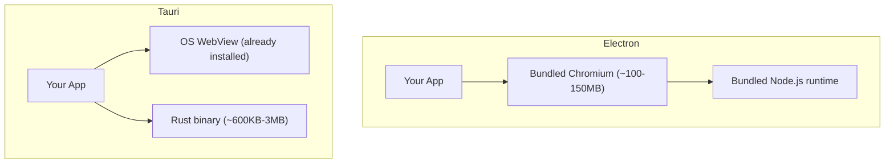
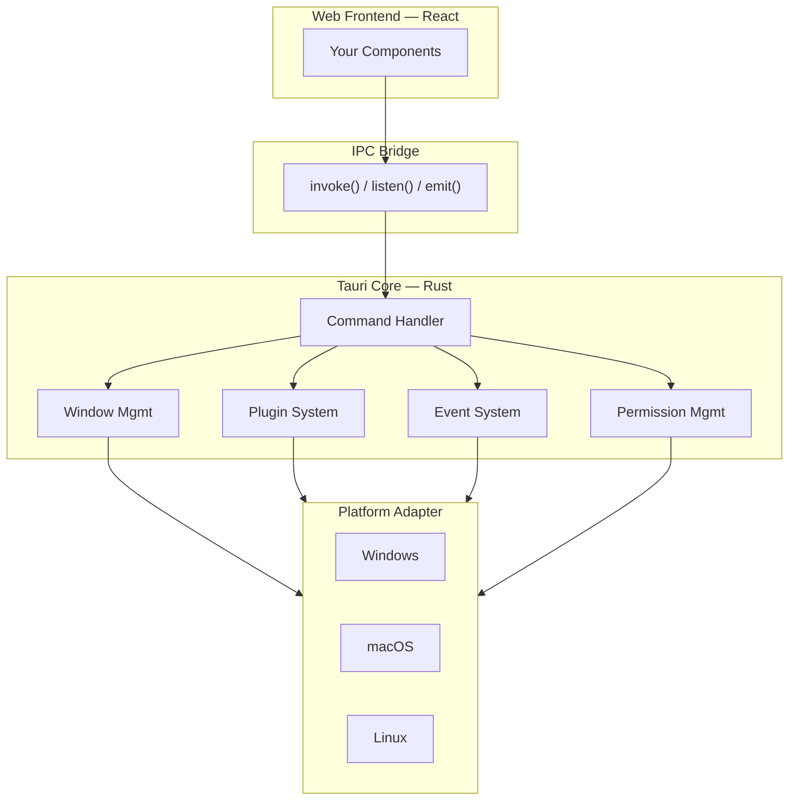

> **Table of Contents:**
>
> - [The Weight Problem, and the Bigger One Underneath](#the-weight-problem-and-the-bigger-one-underneath)
> - [What Tauri Actually Is](#what-tauri-actually-is)
> - [The Running Use Case: A Local Source Inspector](#the-running-use-case-a-local-source-inspector)
> - [Laying the Foundation](#laying-the-foundation)
> - [The Command Layer](#the-command-layer)
> - [Four Architectures for Adding a New Source](#four-architectures-for-adding-a-new-source)
> - [Comparing the Four](#comparing-the-four)
> - [Building for Scale](#building-for-scale)
> - [The Frontend Side](#the-frontend-side)
> - [The Trade-offs Nobody Mentions Upfront](#the-trade-offs-nobody-mentions-upfront)
> - [Releases and Binary Distribution](#releases-and-binary-distribution)
> - [When Tauri Makes Sense](#when-tauri-makes-sense)

---

## The Weight Problem, and the Bigger One Underneath

Every Electron app ships a browser. Not a metaphor for one — an actual copy of Chromium, bundled into the installer, running as its own process, so that a todo list app can weigh 150MB and idle at 200MB of RAM.

Tauri's answer is almost rude in its simplicity: don't ship a browser. Use the one already on the machine.



A hello-world Tauri app compiles to roughly 2MB<cite index="7-1">, and even full-featured Tauri applications stay remarkably small compared to their Electron equivalents</cite>. That part is a solved problem — pick Tauri, get the size and memory numbers almost for free.

The harder problem is underneath it, and it's not about bytes: **how do you let an app take on new capabilities after it ships, without every addition becoming a small risk to everything already working?** This is the actual subject of the post. Binary size gets one section. Extensibility gets most of the rest, because it's where "heavy" desktop apps actually go wrong — not by being big, but by becoming impossible to safely add to.

---

## What Tauri Actually Is

Tauri isn't "Electron but Rust." The architecture is genuinely different in shape.



Three things matter here, and they're the same three things every architecture later in this post is measured against:

**The frontend is sandboxed.** Your React code runs inside the OS WebView, with no direct filesystem or process access. Every capability goes through a Rust **command**, explicitly registered and explicitly permissioned. This is the whole security model, and it's why Tauri apps don't inherit Electron's long history of "a renderer bug means full system access" CVEs.

**The IPC bridge is the only door.** `invoke()` calls a Rust function and awaits its return value. `listen()` subscribes to events pushed from Rust. `emit()` pushes events the other way.

**Plugins are how Tauri itself is built.** As of Tauri 2, most of what used to be built-in — filesystem access, HTTP, notifications, the shell, the clipboard — has been extracted into official plugins<cite index="4-1">, each with its own permission scope, so that adding a capability to the framework doesn't mean touching Tauri's core</cite>. Tauri's own extensibility problem and your app's extensibility problem are the same problem, at different scales.

---

## The Running Use Case: A Local Source Inspector

To keep the architecture discussion concrete, everything below is worked through against one use case: **a desktop app that ingests data from local "sources" — a directory of log files, a running Docker daemon, a local Postgres instance, a systemd unit list — normalizes it, and displays it as a searchable timeline.**

The one property of this app that matters architecturally: **the list of sources is not fixed.** New source types get added after the app ships — sometimes by the core team, sometimes (in the more ambitious versions of this kind of tool) by someone outside it. Every section from here is really asking the same question from a different angle: *what does it cost, technically, to add one more source?*

---

## Laying the Foundation

A Tauri project is two codebases glued together by one config file. `create-tauri-app` scaffolds it:

```bash
npm create tauri-app@latest inspector -- --template react-ts
cd inspector
```

```
inspector/
├── src/                    # React frontend
│   ├── components/
│   ├── stores/
│   └── main.tsx
├── src-tauri/               # Rust backend
│   ├── src/
│   │   ├── main.rs
│   │   ├── commands/
│   │   ├── sources/
│   │   └── state.rs
│   ├── Cargo.toml
│   ├── tauri.conf.json      # the glue: window config, bundling, permissions
│   └── capabilities/        # what the frontend is allowed to call
└── package.json
```

The `capabilities/` folder is worth pausing on. Every command the frontend can invoke has to be explicitly granted, per window, in a capability file:

```json
{
  "identifier": "main-capability",
  "windows": ["main"],
  "permissions": [
    "core:default",
    "shell:allow-execute",
    "fs:allow-read-file"
  ]
}
```

No entry, no access — even if the Rust command exists and is registered. This becomes relevant again once sources start needing different OS-level access (a Docker source needs the socket; a Postgres source needs the network).

---

## The Command Layer

Commands are just Rust functions with an attribute macro, called from React like a normal async function. Here's the log-file source doing an initial scan:

```rust
// src-tauri/src/commands/sources.rs
use tauri::State;
use crate::state::AppState;

#[tauri::command]
async fn scan_source(
    source_id: String,
    state: State<'_, AppState>,
) -> Result<Vec<Entry>, String> {
    let registry = state.sources.lock().await;
    let source = registry.get(&source_id).ok_or("unknown source")?;

    source.scan().await.map_err(|e| e.to_string())
}
```

```tsx
// src/stores/sourceStore.ts
import { invoke } from "@tauri-apps/api/core";

const entries = await invoke<Entry[]>("scan_source", { sourceId: "docker" });
```

A few things worth noticing, because they're the recurring gotchas regardless of which extensibility architecture ends up underneath `scan_source`:

**Errors cross the bridge as strings, by default.** `Result<T, String>` is the easy path, but it flattens every error into text on the JS side. For anything beyond a prototype, define a serializable error enum with `serde` and implement `From` conversions — you want `error.kind === "SourceUnreachable"` in React, not string matching.

**State is shared, so it's locked.** `AppState` lives behind an `Arc<Mutex<...>>` (or `tokio::sync::Mutex` for anything held across an `.await`).

**Commands should be thin.** `scan_source` doesn't know what a Docker source or a Postgres source actually does — it just looks one up and calls a trait method. That indirection is the seam the next section builds on.

---

## Four Architectures for Adding a New Source

This is the actual decision point, and it's one every extensible desktop app makes whether or not it's made consciously. There are four common answers to "how does a new source get added," and they trade off differently on safety, performance, update velocity, and who's allowed to write one.

### 1. Static trait objects + a compile-time registry

The default choice, and the right one for most apps. A trait defines the contract; a registry holds `Box<dyn Source>`; adding a new source means writing a struct and one line in `main.rs`.

```rust
// src-tauri/src/sources/mod.rs
#[async_trait::async_trait]
pub trait Source: Send + Sync {
    fn id(&self) -> &'static str;
    async fn scan(&self) -> Result<Vec<Entry>, SourceError>;
}

pub struct SourceRegistry {
    sources: HashMap<String, Box<dyn Source>>,
}

impl SourceRegistry {
    pub fn register(&mut self, source: Box<dyn Source>) {
        self.sources.insert(source.id().to_string(), source);
    }
}

// main.rs
let mut registry = SourceRegistry::default();
registry.register(Box::new(LogFileSource::new(&config)));
registry.register(Box::new(DockerSource::new()));
registry.register(Box::new(PostgresSource::new(&conn_str))); // the new one
```

**Tradeoffs:** compiles to a single static binary, zero runtime overhead, full type safety, trivial to unit test in isolation. The cost is that adding a source requires a recompile and a new release — there's no way for anyone outside the codebase to add one without a PR merging into it.

### 2. Dynamic library loading

Sources compiled as separate `.so`/`.dll`/`.dylib` files, loaded at runtime with `libloading`:

```rust
use libloading::{Library, Symbol};

unsafe {
    let lib = Library::new("./sources/postgres_source.so")?;
    let constructor: Symbol<unsafe extern "C" fn() -> *mut dyn Source> =
        lib.get(b"create_source")?;
    let source = Box::from_raw(constructor());
    registry.register(source);
}
```

**Tradeoffs:** genuinely runtime-loadable, no recompile of the core app needed to add a source. But Rust has no stable ABI across compiler versions — a plugin built with one `rustc` release can silently miscompile or crash against a host built with another, which pushes most real deployments toward pinning exact toolchain versions on both sides, or exposing a C ABI (`extern "C"`) at the boundary and paying for it in ergonomics. This whole `unsafe` block is also, unavoidably, unsafe: a buggy plugin can corrupt the host process. Vanishingly few teams choose this path once they've read the caveats.

### 3. WASM-based plugin sandboxing

Sources compiled to WebAssembly, run inside a sandboxed runtime like `wasmtime`:

```rust
use wasmtime::{Engine, Store, Module, Linker};

let engine = Engine::default();
let module = Module::from_file(&engine, "sources/postgres_source.wasm")?;
let mut store = Store::new(&engine, ());
let instance = Linker::new(&engine).instantiate(&mut store, &module)?;

let scan = instance.get_typed_func::<(), i32>(&mut store, "scan")?;
let result_ptr = scan.call(&mut store, ())?;
```

**Tradeoffs:** this is the only one of the four where a plugin can be genuinely untrusted — WASM's sandbox means a misbehaving or malicious source can't read arbitrary memory or touch the filesystem except through capabilities you explicitly grant via WASI. That's what makes it the right choice if sources are ever meant to come from outside the core team. The cost is real: passing structured data across the WASM boundary means serializing through linear memory (usually via something like `wit-bindgen` or hand-rolled byte buffers), performance is meaningfully below native for anything CPU-heavy, and debugging a crash inside the sandbox is a step removed from a normal Rust stack trace.

### 4. Sidecar processes

A source runs as an entirely separate binary — possibly in a different language — spawned as a subprocess and talked to over stdio or a local socket:

```rust
use tauri_plugin_shell::ShellExt;

let sidecar = app.shell().sidecar("postgres_source")?;
let (mut rx, _child) = sidecar.args(["--scan"]).spawn()?;

while let Some(event) = rx.recv().await {
    if let CommandEvent::Stdout(line) = event {
        // parse a line of NDJSON into Entry
    }
}
```

**Tradeoffs:** this is the only option that gets you language freedom — a Postgres source could be a small Python script using `psycopg2` instead of a Rust database driver, which matters if the fastest path to a working integration runs through a library that only exists in another ecosystem. Process isolation also means a crashing source takes down its own process, not the host app. The cost is the heaviest of the four operationally: each sidecar is a process to spawn, monitor, restart on crash, and ship per-platform, and the IPC (stdio parsing, or a socket protocol) is something you design and version yourself, since there's no shared type system across the boundary.

---

## Comparing the Four

| | Static trait registry | Dynamic library (`libloading`) | WASM sandbox | Sidecar process |
|---|---|---|---|---|
| Requires recompiling the core app | Yes | No | No | No |
| Safe against a misbehaving plugin | N/A — same trust domain | No | Yes | Partially (isolated process, not memory-safe by construction) |
| Runtime performance | Native | Native | Below native | IPC overhead per call |
| Plugin language freedom | Rust only | Rust only (practically) | Any language targeting WASM | Any language |
| Operational complexity to add one plugin | Low | Medium | Medium–high | High |
| Who can realistically write a plugin | Core team | Core team | Core team, or trusted third parties | Core team, or anyone who can spawn a process |

For the source-inspector use case, the honest answer is that **most sources belong in the static registry** — Docker, systemd, and log files are all things the core team writes and ships together, and there's no reason to pay a sandboxing or IPC cost for code you already trust. The exception is Postgres, or any source that talks to arbitrary user-provided infrastructure: if there's ever a plan to let third parties ship source plugins, that's the point where WASM earns its overhead, because it's the only option here that lets you grant a stranger's code exactly the capabilities you choose and nothing else.

---

## Building for Scale

"Heavy" means the app can do real, sustained work — scanning large log directories, tailing multiple Docker containers, running Postgres queries against big tables — without freezing the UI or falling over under its own concurrency, regardless of which of the four architectures a given source uses.

**Async by default, but watch the blocking calls.** Tauri's async runtime is Tokio. Anything that blocks a thread — synchronous file I/O, a CPU-bound parse — has to go through `spawn_blocking`, or it stalls every other `.await` sharing that thread:

```rust
let stats = tokio::task::spawn_blocking(move || {
    compute_log_stats(&path) // CPU-bound, not async
}).await??;
```

**Persisted state through a real database, not JSON files.** `sqlx` with SQLite gives the app a local, transactional store for normalized entries across sources:

```rust
sqlx::query!(
    "INSERT INTO entries (source_id, message, seen_at) VALUES (?, ?, ?)",
    entry.source_id, entry.message, entry.timestamp
).execute(&pool).await?;
```

**Multiple webviews for complex layouts.** Tauri v2 supports multiple windows and multiple webviews inside a single window<cite index="7-1">, which is what makes a sidebar-plus-timeline layout — or an always-on-top mini widget alongside a full inspector window — a first-class pattern rather than a hack</cite>, all sharing the same Rust backend regardless of how many source architectures are running underneath it.

---

## The Frontend Side

The React half stays deliberately boring. The frontend's job shrinks to: render state, dispatch commands, listen for events — it never needs to know whether a given source is a static trait object, a WASM module, or a sidecar process.

```tsx
// stores/sourceStore.ts — Zustand, not Redux; this state is small and local
import { create } from "zustand";

interface SourceStore {
  entries: Entry[];
  addEntries: (entries: Entry[]) => void;
}

export const useSourceStore = create<SourceStore>((set) => ({
  entries: [],
  addEntries: (entries) => set((s) => ({ entries: [...s.entries, ...entries] })),
}));
```

```tsx
import { listen } from "@tauri-apps/api/event";

useEffect(() => {
  const unlisten = listen<Entry[]>("source:entries", (event) => {
    addEntries(event.payload);
  });
  return () => { unlisten.then(fn => fn()); };
}, []);
```

A few habits worth keeping, learned the hard way in apps that got this wrong:

- **Never trust the frontend to hold source-of-truth state.** Rust owns the source registry, the DB, the process lifecycle. If the app restarts, `invoke("get_entries")` on mount rebuilds the store from SQLite, not from memory.
- **Debounce re-renders on high-frequency events.** A log-tailing source can emit dozens of events a second. Batch them client-side rather than triggering a re-render per event.
- **Keep `invoke` calls typed end-to-end.** Generate TypeScript types from the Rust structs (via `tauri-specta` or hand-kept mirrors), so a renamed Rust field breaks the build instead of silently returning `undefined` in production.

---

## The Trade-offs Nobody Mentions Upfront

The pitch is clean. Reality has texture.

### The WebView isn't one thing

"Runs in the OS WebView" means three different rendering engines: WebView2 (Chromium-based, Windows), WebKitGTK (Linux), WKWebView (macOS). A CSS grid bug you'll never see on Windows can show up on Linux. Testing "cross-platform" means actually running on all three.

### Mobile is real but younger

Tauri 2 does ship iOS and Android support from the same codebase<cite index="9-1">, which is the headline feature that pulled a lot of teams over from Electron-plus-React-Native in the first place</cite>. But the mobile path is newer, has a smaller plugin ecosystem, and touches native Swift/Kotlin code for anything beyond official plugins.

### The permission model has a cost

Every capability needs an entry in `capabilities/*.json`. Good for security, mildly annoying for velocity — a new source that needs to spawn a shell command means remembering to grant `shell:allow-execute`, and forgetting it produces a runtime permission error, not a compile error.

### Binary size is small, RAM usage is not automatically small

A 2MB binary doesn't mean a 2MB memory footprint. Once several sources, a connection pool, and a WebView are all running, idle RAM lands closer to double digits of MB — still a fraction of Electron's baseline, but "basically free" is the wrong mental model for continuous background work.

### Debugging crosses two languages, and sometimes more

A bug that spans an `invoke()` call means a stack trace in Rust and a separate one in the browser devtools, with nothing connecting them automatically. Add a WASM sandbox or a sidecar process into the mix and there's a third or fourth runtime in the failure path. Structured logging with a shared `correlation_id` pays off here even inside a single process, and becomes closer to mandatory the moment sidecars are involved.

---

## Releases and Binary Distribution

This is where a lot of Tauri tutorials stop short, and it's the part that actually determines whether the app reaches anyone.

### The build matrix

A single GitHub Actions workflow, using the official `tauri-action`, builds and publishes for every target from one tag push:

```yaml
name: publish
on:
  push:
    tags: ["v*"]

jobs:
  publish-tauri:
    permissions:
      contents: write
    strategy:
      fail-fast: false
      matrix:
        include:
          - platform: "macos-latest"
            args: "--target aarch64-apple-darwin"
          - platform: "macos-latest"
            args: "--target x86_64-apple-darwin"
          - platform: "ubuntu-22.04"
            args: ""
          - platform: "windows-latest"
            args: ""
    runs-on: ${{ matrix.platform }}
    steps:
      - uses: actions/checkout@v4
      - uses: actions/setup-node@v4
        with: { node-version: lts/* }
      - uses: dtolnay/rust-toolchain@stable
      - name: install Linux deps
        if: matrix.platform == 'ubuntu-22.04'
        run: |
          sudo apt-get update
          sudo apt-get install -y libwebkit2gtk-4.1-dev libayatana-appindicator3-dev
      - run: npm install
      - uses: tauri-apps/tauri-action@v0
        env:
          GITHUB_TOKEN: ${{ secrets.GITHUB_TOKEN }}
        with:
          args: ${{ matrix.args }}
```

Push `git tag v0.1.0 && git push --tags`, and the workflow builds `.dmg` for both Apple Silicon and Intel, `.deb` and `.AppImage` for Linux, and `.msi`/`.nsis.exe` for Windows<cite index="10-1">, all in parallel from a single tag push</cite>, uploading everything to a GitHub Release automatically. If any sources use the sidecar architecture, each platform's matching sidecar binary needs to be built and bundled alongside — one more reason the static-registry approach stays the default for anything not requiring language freedom or a sandbox.

### Code signing, per platform, is non-negotiable

Unsigned binaries get flagged. macOS Gatekeeper blocks unnotarized apps outright; Windows SmartScreen warns hard enough that most users won't click through.

- **macOS**: an Apple Developer ID Application certificate plus `notarytool`, both environment-variable driven so secrets stay out of the repo<cite index="10-1">, wired into the same `tauri-action` step via `APPLE_CERTIFICATE`, `APPLE_ID`, and `APPLE_TEAM_ID` secrets</cite>.
- **Windows**: since mid-2023, certificate authorities stopped issuing exportable OV code-signing certificates<cite index="17-1">, which pushes most teams toward hardware-backed EV certificates — an HSM or a YubiKey — signed through a CI-compatible tool rather than a bare `.pfx` file</cite>.
- **Linux**: no OS-level gatekeeping equivalent, though `.deb`/`.rpm` package signing matters if you're distributing through a repository rather than a direct download.

### The updater closes the loop

A signed installer that never updates itself just becomes a support burden. Tauri's official updater plugin checks a hosted manifest, downloads the matching platform artifact, verifies it against a signing key generated separately from your code-signing certs, and installs on next launch.

---

## When Tauri Makes Sense

Not every app needs any of this. A settings panel wrapping three REST calls doesn't need a plugin architecture at all — that's complexity theater for a problem you don't have.

Tauri starts earning its keep when:

**The app needs to feel native, not just look like one.** Binary size, idle memory, and startup time are user-facing.

**New capability needs to arrive without a rewrite of the core.** Whether that's solved with a static registry, dynamic loading, WASM, or sidecars depends entirely on how much you trust the code adding the capability and how much performance you can spend on isolating it — there's no universally correct choice among the four, only a correct one for a given trust and performance budget.

**The heavy lifting genuinely needs a systems language.** Scanning large log files, tailing multiple processes, querying large datasets — the kind of work Python or Node do reluctantly — is where Rust's async runtime and low overhead actually show up in the numbers.

**Desktop and mobile need to share more than an API.** Tauri 2's mobile support means the same Rust core and much of the same React frontend can ship to five platforms from one repository.

The mental shift, coming from Electron, is the same shift that runs through all four extensibility architectures above: stop asking "how do I make the browser do this," and start asking "how much do I trust the code adding this capability, and what am I willing to pay — in performance, in build complexity, in operational overhead — to isolate it appropriately." Answer that per capability, not once for the whole app, and the architecture tends to fit the actual requirement instead of the other way around.